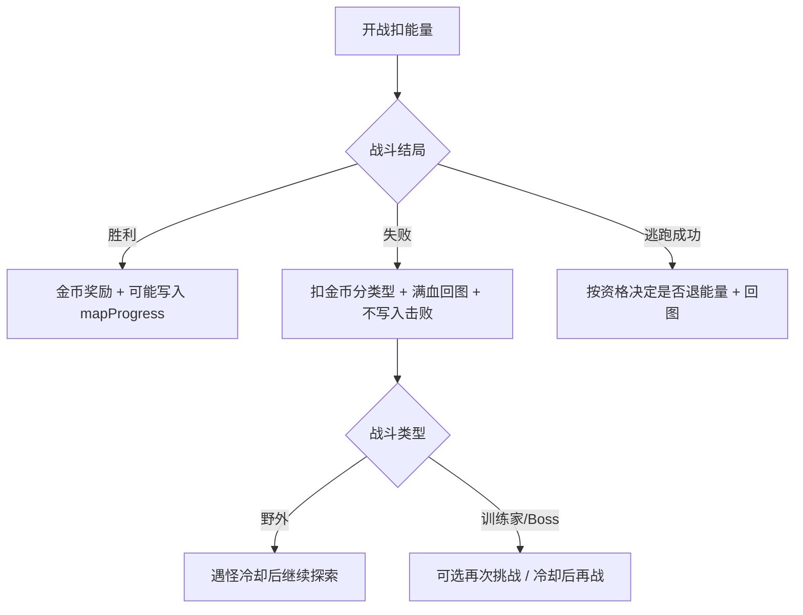

# 战斗失败系统升级详细设计文档（方案 B）

## 0. 执行顺序（必读）

> **本方案的全部开发工作，必须在以下两层前置均完成之后执行：**
>
> 1. 主地图已扩大为 **100×100** 并验收（`MAP_GAMEPLAY_UPGRADE_PLAN.md` **§6 阶段零**）  
> 2. 地图玩法升级（该文档 **§6 阶段一～八** 或 §7 第一版范围 + 野生档位）已验收  
>
> 不得与扩图、地图主线（固定训练师、部下、Boss、`mapProgress` 等）并行抢改同一套战斗/存档链路。

### 0.1 前置完成标准（启动本文档前的检查清单）

满足以下 **全部** 条件后，方可启动本文档的实施：

| # | 条件 | 对应文档 |
|---|------|----------|
| 0 | 主地图逻辑网格 **100×100**，行走/镜头/遇敌/存档位置验收通过 | `MAP_GAMEPLAY_UPGRADE_PLAN.md` §0、§6 阶段零 |
| 1 | 阶段一～八均已验收，或第一版落地范围（§7）+ 野生档位（§4.8 / 阶段三-B）已上线 | 同上 §6、§7 |
| 2 | `mapProgress` 已写入云端存档，含 `defeatedTrainerIds`、`defeatedBossIds` 等字段 | §5.4、§8.1 |
| 3 | 固定训练师 / 部下 / Boss 战斗可走配置队伍，**不再随机生成训练师队伍** | 阶段三 |
| 4 | Boss 击败前锁定、3/3 部下后解锁 Boss 已可用 | 阶段四 |
| 5 | 训练师 / Boss **胜利** 后正确写入已击败状态；**失败** 不写入已击败 | 阶段三、§4.1 |
| 6 | 连战挑战（若已做）支持失败后重试 | 阶段六 |

### 0.2 与地图文档的衔接点

地图升级完成后，失败系统需要直接消费这些能力（本文档实施时依赖）：

- `battleKind` 能区分：`wild` / `trainer`（及未来的 `boss`、`trial` 等地图配置类型）。
- `world.mapProgress.defeatedTrainerIds`：失败 **不** 追加 ID；胜利才追加。
- 地图事件 ID：训练师/Boss 失败后可「再次挑战」同一 `eventId`。
- `getBattleEnergyCost({ battleKind, mapLevel })` 已区分野外与训练家（Boss 能耗在地图文档 §8.4 定稿后接入）。

### 0.3 本文档在整体路线图中的位置

```text
0. 地图扩大至 100×100（MAP_GAMEPLAY §6 阶段零）   ← 最先完成
1. 地图玩法升级（MAP_GAMEPLAY §6 阶段一～八）     ← 100×100 后执行
2. 队伍/仓库升级（POKEMON_ROSTER_STORAGE_UPGRADE_PLAN）  ← 可与 1 按排期并行
3. 战斗失败系统升级（本文档 · 方案 B）          ← 地图玩法验收后执行
```

---

## 1. 文档目标

在**不劝退课堂向学生**的前提下，把「战斗失败」从「统一扣金 + 满血回城」升级为 **分级后果 + 透明账单 + 轻量教学 + 可再战**，并与地图章节（训练家、部下、Boss）规则一致。

### 1.1 设计原则

1. **可继续玩**：失败不删档、不丢宝可梦、不永久锁死进度。
2. **有代价但不劝退**：惩罚可感知，单次损失远小于一场胜利收益。
3. **规则好懂**：学生能一句话说清「输了 / 逃了 / 赢了」各会怎样。
4. **与地图分工清晰**：地图文档管「谁在哪儿、打赢解锁什么」；本文档管「打输/逃跑的结算与 UI」。

### 1.2 非目标（第一版不做）

- 失败后半血回城、治疗站付费满血（硬核模式，见 §8 可选）。
- 老师端失败统计看板（P2 可选）。
- 修改「地图探索不直接奖金币」的总规则（失败扣金仍来自已有金币池）。

---

## 2. 当前基线（截至文档编写时）

以下能力**已在代码中实现**，本文档后续阶段在其上迭代，不重复造轮子：

| 能力 | 行为 | 主要位置 |
|------|------|----------|
| 失败触发 | 全队 HP 归零 → `battlePhase: 'defeat'` | `OriginalGame.jsx` `handlePlayerDefeatCheck` |
| 替补 | 单只倒下 → 队伍页换人，不算失败 | 同上 |
| 失败扣金 | `getDefeatGoldPenalty({ battleKind, mapLevel })` 野外约 10～28，训练家约 18～45 | `gameBalance.js` |
| 失败恢复 | 全队满 HP/MP，回地图，遇怪冷却 | `handleDefeatContinue` |
| 能量 | 开战扣除；**失败不退** | `handleEncounter` / 训练师开战 |
| 逃跑成功 | 只有未进行攻击、用药、扔球、主动换人且直接逃跑成功时才退回本场已扣能量 | `battleEnergyRefundEligible` + `activeBattleEnergyCostRef` + `handleEscapeContinue` |
| 道具 | 本场已用药/球不退 | 背包消耗逻辑 |
| 失败 UI | `BattleDefeatOverlay`（含扣金文案） | 组件 + `index.css` |

### 2.1 已知缺口（方案 B 要补齐）

- 野外 / 训练家 / Boss 失败 **文案与惩罚未分级展示**（Boss 类型待地图接入后区分）。
- 无「本场账单」与开战前 **风险预告**。
- 无失败原因 **轻提示**（等级、属性克制等）。
- 仍可能存在旧 `gameOver` 失败弹窗与 `BattleDefeatOverlay` **双轨**（需合并）。
- 训练师/Boss **再次挑战**、Boss **失败冷却** 未与 `mapProgress` 联动（依赖地图阶段三、四）。

---

## 3. 方案 B 总览：分级后果 + 轻教学 + 可选再战

### 3.1 结局规则表（目标态）

| 结局 | 金币 | 能量 | HP/MP | 道具 | 地图进度 |
|------|------|------|-------|------|----------|
| **胜利** | +战斗奖励 | 开战已扣，不退 | 清临时状态；训练家战可选全队回满（与地图配置一致） | 已消耗不退 | 训练师/Boss **仅胜利** 写入已击败 |
| **失败** | -少量（分类型，§4.1） | 开战已扣，不退 | 全队回满（课堂模式） | 已消耗不退 | **不** 写入已击败 |
| **逃跑成功** | 不变 | 未进入战斗行为才退回本场；已攻击/用药/扔球/换人/逃跑失败后不退 | 清临时状态 | 已消耗不退 | 无变化 |
| **捕捉成功** | 不变 | 开战已扣，不退 | 入队满血（`acquireMonster` 见仓库文档） | 球已消耗 | 无变化 |

**给学生的一句话：**

> 打赢有奖；打输扣一点钱、能量不退；刚遇到就撤退才退能量，打过、用过道具或扔过球再逃就不退。

### 3.2 流程关系



---

## 4. 分级惩罚与文案

### 4.1 金币惩罚（在现有 `getDefeatGoldPenalty` 上扩展）

| 战斗类型 | 建议标题 | 基础扣金 | 上限 | 备注 |
|----------|----------|----------|------|------|
| `wild` | **战斗失利** | 8 | 20 | 略低于当前野外上限，减轻刷野挫败感 |
| `trainer` | **挑战失败** | 15 | 35 | 含普通训练师、部下（`trainerRole` 由地图配置传入） |
| `boss` | **首领战失利** | 20 | 45 | 地图阶段四完成后启用 |
| `trial` | **试炼中止** | 12 | 28 | 连战挑战中途失败（地图阶段六完成后启用） |

实现建议：

- `getDefeatGoldPenalty({ battleKind, mapLevel, trainerRole })` 扩展参数；`mapLevel` 仍用「每 5 级 +2」软递增。
- **可选（P1）**：`penalty = clamp(floor(victoryGold * 0.4), min, max)`，避免「赢 15 输 25」倒挂（需同场 `calculateBattleRewards` 估算）。

### 4.2 能量与道具（维持现状，仅透明化）

- **失败、胜利**：能量不退（已在开战时扣除）。
- **逃跑成功**：只有 `battleEnergyRefundEligible === true` 时退回 `activeBattleEnergyCostRef` 记录的本场数额；玩家攻击、用药、扔球、主动换人或逃跑失败后，该资格会失效。
- **道具**：本场使用的回复药 / 精灵球不退；在失败账单中列出「已消耗」种类与数量（只读展示）。

### 4.3 恢复策略（课堂模式，默认）

- 失败后：**全队 `currentHp = maxHp`，`currentMp = maxMp`**，传送回地图当前位或章节安全点（Boss 战可选回营地，地图配置 `defeatRespawn`）。
- 遇怪冷却：沿用 `ENCOUNTER_SAFE_STEPS`（默认 5 步）。

### 4.4 UI 文案与视觉

| 项目 | 建议 |
|------|------|
| 图标 | 去掉 💀；改为晕倒宝可梦 / 精灵球暗色图标 |
| 副标题 | 固定结构：**账单三行**（见 §5.1） |
| 主按钮 | 「重整旗鼓」→ 回地图 |
| 次按钮（P0 可选） | 「去商店」→ `view: 'shop'` |

---

## 5. 失败过场与开战预告

### 5.1 失败结算页「本场账单」

在 `BattleDefeatOverlay` 展示（示例）：

```text
挑战失败
────────────────
损失金币        -18
能量            已消耗 2（不退）
道具            好伤药 x1
────────────────
队伍已恢复，可继续探索
```

数据来源：

- `goldPenalty`：`getDefeatGoldPenalty`
- `energySpent`：开战时写入 `battlePhaseData` 或 ref 同步到 overlay
- `itemsUsedThisBattle`：战斗内维护 `battleConsumables` 数组（用药/用球 push 记录）

### 5.2 开战前风险预告

在以下入口增加一行灰色小字（P0）：

- 野外踩草遇敌确认（若有确认框）或首次进入战斗 intro 前。
- 地图训练师 / Boss 对话确认「开始对战」按钮上方。

文案模板：

```text
失败约扣除 {penalty} 金币，能量不退；刚遇到就直接逃跑成功才退回能量。
```

`penalty` 用 `getDefeatGoldPenalty` 预计算。

### 5.3 失败原因轻提示（P0，随机 1 条）

在过场账单下方展示，规则示例：

| 条件 | 提示 |
|------|------|
| `enemyAvgLevel - playerAvgLevel >= 3` | 对方等级更高，先去练级或使用回复药。 |
| 敌方属性克制我方首发 | 试试克制对方属性的宝可梦或技能。 |
| 后备存活数 = 0 且队伍 < 6 | 多带几只宝可梦上场，倒下后可以换人。 |
| 默认 | 调整队伍或药品后再来挑战。 |

实现：`buildDefeatHint({ playerTeam, enemyTeam, battleKind })` 纯函数，不依赖 AI。

---

## 6. 与地图玩法的联动（地图完成后实施）

> 本节依赖 `MAP_GAMEPLAY_UPGRADE_PLAN.md` 阶段三、四、六的交付物。

### 6.1 训练师失败：可再战

- 失败 **不** 向 `defeatedTrainerIds` 写入该 `eventId`。
- 过场按钮：
  - **再次挑战**：关闭过场 → 原地再次调用该训练师开战（再扣能量、再验金币惩罚预告）。
  - **先回地图**：现有 `handleDefeatContinue` 行为。
- 普通训练师 / 部下共用逻辑；部下失败不触发 Boss 解锁进度。

### 6.2 Boss 失败：短冷却

- 失败后写入 `mapProgress.bossRetryAvailableAt[eventId] = now + cooldownMs`（建议 30～60 秒，可配置）。
- 冷却内：地图 Boss 模型显示「休整中」，点击提示剩余秒数。
- 冷却结束：可再战；仍不写入 `defeatedBossIds` 直至胜利。
- 扣金使用 `battleKind: 'boss'` 行（§4.1）。

### 6.3 连战试炼失败（阶段六完成后）

- 单场失败即中止连战，扣金走 `trial` 行。
- 不发放连战分段奖励；`completedChallengeIds` 不写入。
- 提供「重新挑战试炼」入口（整张连战重开，能量再扣）。

### 6.4 与地图文档冲突处理

若地图配置写「Boss 失败送泉水恢复」等特例，以 **地图事件配置** 覆盖默认失败恢复（`defeatEffects` 字段），本文档默认规则为 fallback。

---

## 7. 实现阶段计划（方案 B）

### 阶段 D0：文档与开关（0.5 天）

- 确认地图升级 §0.1 前置清单已全部勾选。
- 增加功能开关 `DEFEAT_SYSTEM_V2`（可选，便于灰度）。

### 阶段 D1（P0）：体验与公平感 — 约 1～2 天

| 任务 | 说明 |
|------|------|
| D1.1 | `getDefeatGoldPenalty` 支持 `boss` / `trial` 类型；野外/训练家标题分支 |
| D1.2 | `BattleDefeatOverlay` 账单 UI + `buildDefeatHint` |
| D1.3 | 开战前惩罚/逃跑规则预告（野外 intro + 训练师对话） |
| D1.4 | 战斗内 `battleConsumables` 记录，供账单展示 |
| D1.5 | 合并/删除旧 `gameOver` 失败弹窗，单一失败入口 |
| D1.6 | 失败图标软化（非 💀） |

**验收：**

- 三种标题在 wild/trainer 下正确；账单数字与后端扣金一致。
- 学生能在开战前看到「失败扣约 X 金、逃跑退能量」。
- 仅一条失败 UI 路径。

### 阶段 D2（P1）：地图联动 — 约 2～3 天（依赖地图阶段三、四、六）

| 任务 | 说明 |
|------|------|
| D2.1 | 训练师失败「再次挑战」按钮 + 不写入 `defeatedTrainerIds` |
| D2.2 | Boss `bossRetryAvailableAt` 冷却 + 地图交互禁用 |
| D2.3 | `battleKind: 'boss'` 接入扣金与文案 |
| D2.4 | 连战 `trial` 失败中止与重试（若地图已上线连战） |
| D2.5 | 可选：`penalty` 与 `calculateBattleRewards` 挂钩防倒挂 |

**验收：**

- 训练师失败后地图点仍可挑战，胜利才消失。
- Boss 冷却内无法开战，冷却后可再战。
- 与 `MAP_GAMEPLAY_UPGRADE_PLAN.md` §9 验收不冲突。

### 阶段 D3（P2）：运营与保护 — 按需

| 任务 | 说明 |
|------|------|
| D3.1 | 同地图连续失败 3 次：下次失败金币减半或赠送 1 瓶伤药 |
| D3.2 | 老师端：学生失败次数 / 热点地图统计 |
| D3.3 | 设置项：「课堂模式（失败满血）」/「挑战模式（失败半血）」 |

---

## 8. 数据结构与存档

### 8.1 建议新增（P1 起，写入 `game_data` 或 `world`）

```js
// 可选，失败系统 V2
world: {
  // ...既有 mapProgress...
  defeatStats: {
    consecutiveDefeatsOnMap: 0,  // 当前地图连跪，胜利/逃跑成功清零
    lastDefeatAt: null,          // ISO 时间戳
  },
  bossRetryAvailableAt: {
    // eventId -> timestamp(ms)
    mist_boss: 1710000000000,
  },
}
```

### 8.2 战斗会话内（不必持久化）

```js
battleSession: {
  energySpent: 2,
  consumablesUsed: [
    { itemType: 'potion', itemKey: 'super_potion', quantity: 1 },
  ],
  trainerEventId: 'lieutenant_moss',  // 地图训练师开战时写入
}
```

### 8.3 存档兼容

- 旧存档无 `defeatStats` / `bossRetryAvailableAt` 时按空对象处理。
- 不迁移历史失败记录。

---

## 9. 风险与注意事项

| 风险 | 缓解 |
|------|------|
| 与地图升级同时改 `handleDefeatContinue` | **严格后置**；地图阶段仅约定接口，失败 V2 在 D1 统一改 |
| 扣金与云端不同步 | 优先 `commitCloudSnapshotWithResources`；失败回退 `updateGoldBalance` |
| 再次挑战重复扣能量 | 明确每次「再次挑战」= 新开战，走完整能量检查 |
| 学生金币为 0 | 后端 `adjust_gold` 失败时 UI 提示「金币不足，未扣除」，仍允许回图恢复 |
| 逃跑退能量与地图能耗规则不一致 | Boss 高能耗仍以开战值为准退还，不在失败文档单独改地图 §8.4 |

---

## 10. 测试清单

### 10.1 与地图无关（D1 即可测）

- [ ] 野外失败：扣金、不退能量、满血回图、遇怪冷却。
- [ ] 训练家失败：扣金高于野外、标题为「挑战失败」。
- [ ] 逃跑成功：能量回退、不扣金、账单不显示扣金。
- [ ] 胜利：能量不退、金币奖励正常。
- [ ] 金币不足时失败：提示友好，仍能回图。
- [ ] 刷新页面后金币/能量与云端一致。

### 10.2 依赖地图（D2）

- [ ] 训练师失败：未击败状态，可再次挑战；胜利后事件消失。
- [ ] Boss 失败：冷却内不可战，冷却后可战；胜利写入 `defeatedBossIds`。
- [ ] 部下 3/3 进度：仅胜利计入，失败不推进 Boss 解锁。
- [ ] 连战失败：不写入 `completedChallengeIds`，可重开试炼。

---

## 11. 关联文档

| 文档 | 关系 |
|------|------|
| [`MAP_GAMEPLAY_UPGRADE_PLAN.md`](./MAP_GAMEPLAY_UPGRADE_PLAN.md) | **前置依赖**（含 **100×100 阶段零** + 玩法阶段一～八）；训练师/Boss/连战规则以地图文档为准 |
| [`../MAP_SYSTEM_REBUILD_PLAN.md`](../MAP_SYSTEM_REBUILD_PLAN.md) | 扩图与大地图渲染/性能（阶段零实施参考） |
| [`POKEMON_ROSTER_STORAGE_UPGRADE_PLAN.md`](./POKEMON_ROSTER_STORAGE_UPGRADE_PLAN.md) | 捕捉入队与道具使用边界；失败账单中的道具展示需与「仅队伍可用」一致 |
| [`GAME_SYSTEM_AUDIT_PLAN.md`](./GAME_SYSTEM_AUDIT_PLAN.md) | §7.6 濒死、胜利、失败；实施后回归此项 |
| [`README.md`](../README.md) | 面向用户的规则摘要需随 D1 更新 |

---

## 12. 版本记录

| 版本 | 日期 | 说明 |
|------|------|------|
| 1.0 | 2026-05-19 | 初版：方案 B 全文；明确地图升级完成后执行 |
| 1.1 | 2026-05-19 | 增加硬性前置：地图玩法须在 **100×100** 扩图验收后执行 |
