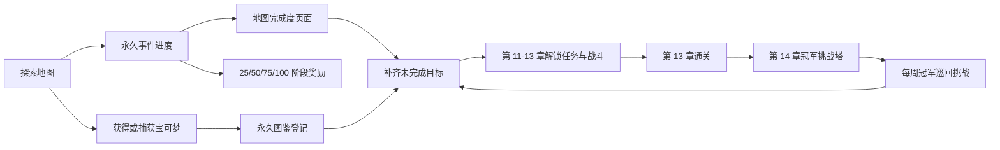

# 长线游玩内容更新计划：地图完成度、永久图鉴、阶段奖励、道馆解锁任务与冠军挑战塔

> 文档状态：**已审核；本地功能实现完成，待数据库部署与分阶段灰度**
> 计划版本：v1.1（新增美术、交互特效与素材品质门槛）
> 编写日期：2026-07-20
> 实施授权：用户已于 2026-07-20 明确要求开始实施并持续记录进度。
> 当前原则：所有功能先经过兼容、存档、视觉与性能验证，再按开关逐步启用。

---

## 1. 更新目标

这次更新不是单纯增加几场战斗，而是补齐一条能够持续驱动玩家探索、收集、领取成果和挑战终局内容的长期循环：

1. 用“地图完成度页面”告诉玩家每张地图还差什么。
2. 用“永久捕获图鉴”保存玩家曾经获得过的宝可梦，不因放生、进化或换仓而消失。
3. 用“阶段完成奖励”给 25%、50%、75%、100% 的探索过程持续反馈。
4. 从第 11 章起，为每名部下和 Boss 增加独立的地图内解锁任务，避免后期只剩连续战斗。
5. 在第 13 章通关后开放第 14 张地图“冠军挑战塔”，形成可持续重复游玩的终局内容。

### 1.1 核心验收目标

- 新玩家可以完整体验新增系统。
- 已有玩家不丢地图位置、宝可梦、背包、金币、体力、任务、首领、隐藏区或挑战进度。
- 已击败的部下和 Boss 绝不被重新锁定。
- 已达到阶段奖励条件的老玩家可直接领取，不要求重新通关。
- 放生宝可梦后，永久图鉴中的“曾获得”和“野外捕获”状态不消失。
- 旧客户端或另一设备产生的延迟存档不能覆盖新增永久进度。
- 新功能关闭或回滚后，原有 13 张地图仍可正常游玩。
- 所有新增页面、机关、奖励和挑战内容都具备与主题一致的视觉、动画、音效及完成反馈；禁止用占位图形、纯文字弹窗或瞬间数字变化代替正式游戏表现。

### 1.2 本次不做

- 不改前 13 张地图现有敌人队伍、等级、技能、捕获率和商店价格。
- 不改变当前体力、每日游玩时长和队伍同物种限制。
- 不加入 PvP、玩家排行榜、交易或付费内容。
- 不把图鉴改成“未捕获就完全看不到资料”；保留现有资料查询体验。
- 不要求指定属性、指定物种、指定等级或额外消费才能挑战第 11–13 章。
- 不重置任何玩家进度，也不自动替玩家领取奖励。
- 不为了“有特效”堆叠闪光、震屏和粒子；表现必须服务于操作辨识、节奏和代入感。

---

## 2. 当前项目基线与章节编号

### 2.1 已核对的现状

当前游戏使用 React/Vite 前端、Supabase 云存档，主要永久进度位于 `game_data.world` JSON 中。现有代码已经具备：

- 地图永久事件记录：训练家、Boss、挑战、宝箱、隐藏入口、生态调查。
- 地图进度汇总函数，可读取训练家、部下、Boss、挑战、稀有解锁、宝箱和生态调查数据。
- 云端存档版本、乐观锁及服务端“只增不减”进度合并。
- 捕获成功后的原子存档，以及失败不影响战斗流程的游戏日志。
- 现有四个地图快捷入口：背包、宝可梦、图鉴、商店。

主要实现位置：

- `src/components/Game/OriginalGame.jsx`
- `src/components/Game/DeferredGamePanels.jsx`
- `src/game/ThreeLowPolyMap.jsx`
- `src/game/data/godotMaps/godot_region_maps.js`
- `src/game/data/overworldMaps.js`
- `src/utils/gameData.js`
- `supabase/migrations/202606020001_preserve_hidden_gate_flags.sql`

### 2.2 章节编号必须按玩家看到的地图顺序计算

代码里的 `regionOrder` 从 0 开始，玩家章节从 1 开始，两者相差 1。实施时统一使用稳定 `mapId`，不允许直接把 `regionOrder` 当章节号。

| 玩家章节 | 地图 | 稳定地图 ID / 当前标识 | `regionOrder` |
|---:|---|---|---:|
| 1 | 新手山谷 | `GodotMap` | 0 |
| 2 | 星音草径 | `GodotMapV2` | 1 |
| 3 | 雾湖苇岸 | `GodotMapV2_MistLake` | 2 |
| 4 | 风车农庄 | `GodotMapV2_FarmTown` | 3 |
| 5 | 贝壳海岸 | `GodotMapV2_PirateShore` | 4 |
| 6 | 月影墓园 | `GodotMapV2_Graveyard` | 5 |
| 7 | 六角遗迹 | `GodotMapV2_HexRuins` | 6 |
| 8 | 铁木营地 | `GodotMapV2_SurvivalRidge` | 7 |
| 9 | 星雾高地 | `GodotMapV2_BossHighland` | 8 |
| 10 | 霜镜道馆 | `GodotMapV2_FrostDojo` | 9 |
| 11 | 深潮道馆 | `GodotMapV2_TideDojo` | 10 |
| 12 | 铁壁道馆 | `GodotMapV2_IronDojo` | 11 |
| 13 | 龙穹道馆 | `GodotMapV2_DragonDojo` | 12 |
| 14 | 冠军挑战塔（新增） | `GodotMapV2_ChampionTower` | 13 |

**本计划锁定的产品解释：**第 14 张地图本身就是“冠军挑战塔”，击败第 13 章龙穹天王后开放。如果审核时希望改成“先有另一张第 14 章地图，通关后再开放挑战塔”，需要先调整本计划再实施。

---

## 3. 总体产品结构



### 3.1 五项统一设计原则

1. **永久事实只增不减。** 捕获登记、任务步骤、奖励领取、最高塔层等状态不能被旧存档覆盖。
2. **显示值尽量派生。** 地图百分比由已存在的永久事件计算，避免再维护一份容易不一致的百分比。
3. **奖励必须幂等。** 每个奖励有唯一领取 ID，重复点击、刷新或双设备并发都只能成功一次。
4. **旧玩家向前兼容。** 已通关内容自动豁免对应新门槛，只给新内容，不收回旧成果。
5. **内容版本冻结。** v1 完成度清单发布后固定；未来新增目标进入 v2，不降低玩家已经得到的 v1 完成度与奖励。

### 3.2 美术、交互特效与游戏感总规范

本节是与存档安全同等级的上线硬门槛。功能“逻辑可用”不等于完成；如果缺少正式素材、交互节奏或主题反馈，对应功能只能保留在开发开关内，不能上线。

#### 3.2.1 每次重要交互必须包含六个节拍

| 节拍 | 玩家感受 | 最低表现要求 |
|---|---|---|
| 发现 | 远处就知道这里值得调查 | 独特轮廓、主题光源、环境动效或声音方位提示，不能只靠悬浮文字 |
| 接近 | 世界对玩家产生回应 | 光强、粒子、环境声或机关局部动画随距离渐进变化 |
| 聚焦 | 明确当前可操作对象 | 主题化描边/符文/底座反馈与清晰按键提示，不使用开发态方框 |
| 操作 | 输入后立即获得触感 | 0–100ms 内出现按压、位移、亮度或短音效反馈；云保存可异步继续 |
| 高潮 | 任务或领取成功有记忆点 | 0.8–2.5 秒主题动画、分层音效和适度镜头构图；允许跳过 |
| 余韵 | 世界永久体现玩家成果 | 机关保持激活形态、地图出现完成印记、图鉴留下徽章或塔楼更新纪录 |

不是每次普通点击都要播放长动画。长表现只用于首次完成、阶段奖励、Boss 解锁和塔层里程碑；重复交互使用 150–400ms 的轻反馈，避免拖慢操作。

#### 3.2.2 禁止作为正式成品上线的表现

- 只显示“已完成 2/3”的白色文本，没有场景物件变化。
- 用默认立方体、圆柱、纯色光圈、Emoji 或 Font Awesome 图标充当新地图机关和核心奖励素材。
- 把同一个模型简单换色后当作深潮、铁壁、龙穹三套核心机关。
- 点击后瞬间改数字，没有按压、启动、成功、失败或已完成状态。
- 用全屏表格、调试列表或系统确认框直接代替奖励揭晓、塔层晋升和冠军仪式。
- 通过高频闪烁、持续震屏、粒子铺满屏幕或过大的发光强度制造“高级感”。
- 使用远程运行时素材链接，或让素材下载失败阻塞玩家返回原有内容。

#### 3.2.3 主题美术方向

| 内容 | 视觉语言 | 动态与材质 | 声音与镜头 |
|---|---|---|---|
| 地图完成度 | 冒险地图册、章节缩略景观、路线刻痕、压印章 | 卡片展开、路线描绘、百分比环缓动、100% 金色压印 | 翻页、铅笔描线、盖章声；只在首次 100% 时轻微推进镜头 |
| 永久图鉴 | 研究手册与扫描档案结合，保留现有清爽卡片 | 已登记卡片从灰阶过渡到正常色，捕获徽章有克制金属掠光，详情页翻页 | 扫描短音、纸页声、登记成功和野外捕获使用不同音色 |
| 阶段奖励 | 地图主题补给匣，而不是普通系统弹窗 | 锁扣弹开、物品卡依次升起、稀有度光带、领取后盖章 | 开匣、物品落点和完成和弦分层；动画只在服务器确认后播放 |
| 深潮机关 | 青蓝水晶、潮纹石、半透明水膜和流动符文 | 水波法线/环形涟漪、潮位上升、雾气和柔和焦散光 | 低频水流、石鸣、潮印嵌入；祭坛完成时水环汇聚到中心 |
| 铁壁机关 | 锻造金属、铆钉、齿轮、磁轨和琥珀炉光 | 炉火点燃、蒸汽、火星、磁弧沿轨道接续、机械锁扣运动 | 金属咬合、炉火、蒸汽泄压；核心启动采用低角度短镜头 |
| 龙穹机关 | 黑曜石、金边龙纹、紫色星辉和悬浮碎片 | 星轨连线、符文逐段点亮、碎片悬浮、光束向穹顶汇聚 | 风鸣、远处龙吟质感、晶体共振；Boss 解锁形成穹顶星座构图 |
| 冠军挑战塔 | 深色石材、冠军金、星空能量与纵向上升结构 | 大厅穹顶、楼层徽记、升降光柱、对手入场灯、冠军奖杯实体陈列 | 独立大厅音乐、升层音效、楼层播报、冠军入场与通关短仪式 |

#### 3.2.4 素材交付标准

每项新内容在开发前先列出完整素材清单，至少覆盖：

- 场景模型：可交互主体、底座、已完成形态和必要的环境陪衬。
- 2D 素材：页面图标、章节缩略图、徽章、奖励框和空/锁定状态。
- VFX：待机、聚焦、操作、成功、已完成；失败或条件不足使用克制反馈。
- 动画：机关零件、材质参数、UI 过渡、塔层转场与冠军仪式。
- 音频：待机环境层、交互起音、步骤完成、整项完成、奖励和塔层晋升。
- 文案：世界内说明、短提示、锁定原因、完成台词和无声音时的字幕/视觉替代。

素材规范：

- 新素材必须保存在本地 `public/assets` 体系并进入相应清单、缓存和按需预加载流程，运行时不依赖外部 CDN。
- 3D 模型沿用当前低多边形美术比例和色彩逻辑，但核心机关必须有原创组合、独特轮廓和主题动画，不能只复用一个基础模型换色。
- 图片优先提供 WebP 与兼容回退；音频提供项目现有格式和合理响度；模型经过压缩并具备移动端复杂度预算。
- 每个素材记录来源、授权、作者/生成方式、版本和用途；没有明确使用权的素材不得进入正式包。
- 临时素材文件名和代码中必须带 `placeholder`，构建审计发现后直接阻止发布。
- 所有新增对象必须配置加载失败回退；回退可以降低装饰密度，但不能退化为挡路物体或让任务无法完成。

#### 3.2.5 性能、舒适度与无障碍

- 复用现有模型缓存、材质发光、音频管理和 `prefers-reduced-motion` 能力，不在每次交互临时下载或重复创建昂贵资源。
- 粒子对象池化并设置移动端上限；离开视野或页面后停止动画、音频并释放非缓存资源。
- 低性能模式降低粒子数量、阴影和环境装饰，保留机关轮廓、状态色、关键动画和音效时序。
- 与实现前同设备基线相比，新增地图常态中位帧率下降不得超过 10%，P95 帧时间恶化不得超过 15%；超过即回到素材和特效优化阶段。
- 遵守系统“减少动态效果”：取消镜头推进、震动和大幅位移，改用淡入、状态光和静态完成构图。
- 重要状态不能只靠红/绿色区分；音效关闭时仍有文字、图形与动画反馈。
- 不使用高频闪烁；任何镜头震动都必须短、弱、可关闭，移动端不强制设备振动。

#### 3.2.6 美术垂直切片审批闸门

全面制作前先完成五个可运行垂直切片：

1. 一张地图完成度卡片从 74% 到 75% 并领取奖励。
2. 一只宝可梦首次捕获后的永久图鉴登记动画。
3. 深潮第一项“双潮校准”从发现、交互到解锁部下的完整过程。
4. 铁壁或龙穹的一套不同主题机关，证明不是深潮机关换色。
5. 挑战塔大厅进入第 1 层、对手登场并升到第 2 层的完整转场。

每个切片交付桌面截图、手机截图、正常动效录屏、减少动态效果录屏、素材清单和性能对比。未通过视觉一致性、反馈清晰度、代入感及性能审核，不得批量制作剩余内容。

---

## 4. 功能一：地图完成度页面

### 4.1 页面入口

- 在地图顶部 HUD 的操作区新增一个独立“进度”图标，放在设置按钮之前。
- 保留底部“背包 / 宝可梦 / 图鉴 / 商店”四个按钮的位置与行为，不挤压现有移动和操作区域。
- 有生态调查的地图，点击现有生态调查条也可以直达当前地图详情。
- 新页面视图名建议为 `adventureProgress`，放入延迟加载面板，避免增加首次进入地图的包体和渲染负担。
- 支持键盘快捷键 `P`；输入框、弹窗或战斗中不响应。

### 4.2 页面结构

页面分成两层：

1. **地图总览**
   - 14 张地图卡片，按章节排列。
   - 显示地图名称、解锁状态、完成百分比、已领取阶段数、待领取红点。
   - 未解锁地图只显示公开名称与解锁条件，不泄露隐藏宝可梦和奖励细节。
2. **地图详情**
   - 显示每个完成目标、当前进度、是否完成、目标说明和定位按钮。
   - 显示四段奖励及“未达成 / 可领取 / 已领取”状态。
   - 第 11–13 章显示当前部下或 Boss 的任务清单。
   - 第 14 章显示最高层、当前周进度和冠军纪录。

### 4.3 完成度计算规则

使用“原子目标”计算，公式为：

`完成度 = floor(已完成原子目标数 / v1 原子目标总数 × 100)`

v1 计入以下永久目标：

| 类别 | 一个原子目标的定义 | 数据来源 |
|---|---|---|
| 训练家 | 每名训练家首次击败一次 | `defeatedTrainerIds` |
| Boss | 每名 Boss 首次击败一次 | `defeatedBossIds` |
| 探索物品 | 每个一次性宝箱/拾取点领取一次 | `collectedEventIds` |
| 地图挑战 | 每个挑战首次完成，以及配置要求的稀有解锁阶段 | `completedChallengeIds` 与挑战阶段记录 |
| 生态调查 | 本地图调查要求全部完成，整体计 1 项 | `mapProgress` / `wildDefeatCounts` |
| 隐藏区域 | 每个永久隐藏入口首次开启 | `world.flags` |
| 解锁任务 | 第 11–13 章每名部下/Boss 对应任务完成 | 新增任务记录 |
| 挑战塔 | 第 14 章每个首次通关楼层 | 新增挑战塔记录 |

规则细节：

- 每日可重复训练家只计算“历史首次胜利”，每日重置不降低完成度。
- 不计入普通野怪击败数、当前持有宝可梦数、金币、等级或每日任务，避免日常波动造成倒退。
- 没有某类内容的地图不会出现空目标，也不会因此无法达到 100%。
- v1 目标 ID 清单发布后冻结在 `mapCompletionCatalog` 中；将来增加宝箱、训练家或挑战时，默认进入 v2 扩展清单。
- 已领取奖励永不因后续版本增加目标而失效。

### 4.4 展示与可用性

- 完成度卡片同时显示百分比和具体数字，例如“宝箱 5/7”，不能只用颜色表达。
- “定位目标”仅高亮当前地图内已经解锁且可到达的公开目标，不传送玩家、不揭露隐藏区谜底。
- 任务、Boss 或塔层仍未解锁时，显示明确的下一步，而不是泛化的“条件不足”。
- 手机端保证交互目标至少 44×44 px，页面可滚动，不遮挡安全区。
- 页面读取纯本地存档数据；只有领取奖励时发起保存请求。

### 4.5 地图完成度页面表现要求

- 总览不是数据表格，而是一册可滚动的冒险地图：每章使用对应地图实景缩略图、地貌色和 Boss/地标剪影建立辨识度。
- 地图卡展开时，已完成目标以路线刻痕依次点亮；25%、50%、75%、100% 使用不同压印章，不能只更换进度条颜色。
- 达到新阶段时先在地图 HUD 出现克制的“可领取”脉冲；进入页面后才播放完整盖章和奖励入口动画，不打断地图移动。
- 100% 首次完成使用 1.5–2.5 秒专属收束：路线合拢、地图章压下、地图主题环境声与完成和弦；之后打开页面只显示静态金章。
- 锁定地图使用雾化地图轮廓和真实前置路线，不用简单灰色矩形加锁头。
- 章节缩略图优先由实际地图固定机位渲染，保证页面画面与玩家进入后的世界一致。

---

## 5. 功能二：永久捕获图鉴

### 5.1 保留现有图鉴体验

现有图鉴仍然允许查看全部已配置宝可梦资料、属性和技能，不把旧页面变成全屏问号。新增以下状态和筛选：

- `全部`
- `已登记`：曾经进入过玩家队伍、仓库或待安置流程并成功保存。
- `野外捕获`：至少有一次成功的野外捕获记录。
- `当前拥有`：当前仍在队伍或仓库，由实时阵容派生，不永久保存。
- `未登记`

每张图鉴卡显示：

- 已登记徽标。
- 野外捕获徽标。
- 当前持有数量。
- 可获得区域仍按现有规则展示；隐藏种类继续遵守原有隐藏规则。

### 5.2 稳定物种键

永久图鉴不得使用每只宝可梦实例的随机 `id`。物种键规则：

1. 优先使用官方图鉴号：`dex:<officialDexNo>`。
2. 没有官方图鉴号时使用稳定基础物种 ID：`species:<baseId>`。
3. 进化后的新形态按新物种登记；原形态记录保留。

### 5.3 登记时机

以下操作成功写入云存档时，同一个原子提交内登记物种：

- 选择初始宝可梦。
- 野外捕获成功。
- 老师发放宝可梦。
- 地图或挑战奖励宝可梦。
- 宝可梦进化完成。

只有野外捕获成功会写入“野外捕获”；初始、奖励和进化只写入“已登记”。捕获动画成功但云保存失败时，不得提前显示已经登记。

放生、存仓、换队、重排队伍不会删除登记状态。

### 5.4 旧玩家迁移

首次加载新版本时执行一次幂等迁移：

1. 从当前队伍、仓库、待安置宝可梦中回填“已登记”。
2. 对迁移后发生的新捕获完整记录“野外捕获”。
3. 可选地从已有 `capture_result` 游戏日志补回能可靠识别的历史捕获，但日志只作为补充，不能覆盖存档事实。
4. 旧日志只保存名字且采集时间晚于部分老存档，已经放生且没有日志的更早捕获无法 100% 还原。页面需用“永久记录从本版本开始完整保存”的说明诚实提示，不能伪造历史记录。

迁移只增加物种键；重复运行结果相同。

### 5.5 建议数据结构

```js
world.dexProgress = {
  version: 1,
  migrationVersion: 1,
  registeredSpeciesKeys: [],
  wildCapturedSpeciesKeys: []
}
```

`当前拥有`和数量始终从 `playerTeam + storageBox + pendingMonsterAcquisition` 计算，不写入永久数组。

### 5.6 永久图鉴表现要求

- 图鉴沿用现有宝可梦图片与资料，不重做已有核心卡片；通过研究手册底纹、登记章、捕获球印记和轻量扫描线建立新增层次。
- 首次野外捕获并完成云保存后，捕获过场自然衔接到 0.8–1.5 秒的图鉴登记卡：图鉴号浮现、轮廓扫描、正式图片显影、捕获徽章落下。
- 初始、奖励和进化登记使用较短的“资料更新”表现，与野外捕获的金属捕获章明显区分。
- 从“当前拥有”切换到“永久登记”时，放生过的物种仍保持正常图片与永久章，避免让玩家误以为成果被删除。
- 批量迁移旧存档时不连续播放几十次登记动画，只播放一次“历史资料已整理”手册动画并显示新增登记数量。
- 所有掠光、扫描和翻页都有减少动态效果版本；快速浏览卡片不能重复触发高成本粒子或音效。

---

## 6. 功能三：地图阶段完成奖励

### 6.1 解锁与领取

- 每张地图设置 25%、50%、75%、100% 四个阶段。
- 完成度越过多个阶段时，所有较低阶段同时变为可领取。
- 玩家在地图详情页手动领取；不在登录时自动塞入背包。
- 每个奖励唯一 ID：`map:<mapId>:completion:v1:<threshold>`。
- 领取按钮提交期间禁用；服务器再次检查资格和领取 ID。
- 背包空间不限制消耗品领取；沿用当前物品数量结构。

### 6.2 奖励表

所有奖励使用现有道具键，避免改变旧物品系统和商店定价。

| 章节 | 25% | 50% | 75% | 100% |
|---|---|---|---|---|
| 1–4 | 精灵球×2 (`pokeball_basic`) | 伤药×2 (`potion`) | 小经验药水×1 | 超级球×1 + 小经验药水×1 |
| 5–8 | 超级球×1 (`pokeball_great`) | 好伤药×2 (`super_potion`) | 中经验药水×1 | 高级球×1 + 中经验药水×1 |
| 9–13 | 高级球×1 (`pokeball_ultra`) | 厉害伤药×2 (`hyper_potion`) | 大经验药水×1 | 高级球×2 + 超级伤药×1 (`max_potion`) |
| 14 | 厉害伤药×2 | 高级球×2 | 超级经验药水×1 | 大师球×1 + 永久冠军奖杯记录 |

平衡约束：

- 前 13 章奖励没有金币、大师球、属性药剂或独占战斗能力，不改变现有主线强度曲线。
- 第 14 章大师球每个账号只可从 100% 奖励领取一次。
- 永久冠军奖杯是展示记录，不提供战斗数值。
- 实施时运行经济审计；如奖励总价值超出当前同章节一次性宝箱预算的 20%，先回到文档调整，不能直接上线。

### 6.3 老玩家补领规则

- 上线时根据现有永久事件即时计算资格。
- 已经 100% 的地图会同时出现四个可领取阶段。
- 不要求重新击败训练家、重开宝箱、重做生态调查或重新开启隐藏区。
- 只提供领取资格，不自动发放，避免登录时大量通知和背包变化。

### 6.4 奖励领取表现要求

- 每张地图的奖励容器继承地图主题：早期地区偏旅行补给箱，道馆使用对应元素徽记箱，挑战塔使用冠军金属匣。
- 玩家点击后先进入“领取中”锁定状态；只有 RPC 成功返回才播放开匣、物品卡升起、数量落入背包和地图盖章动画。
- RPC 失败时容器不打开，使用短促锁扣回弹和可重试提示，不能先展示奖励再回滚。
- 多段补领可以选择“逐个打开”或“一键领取”；一键领取把物品合并成一次 2–3 秒仪式，禁止老玩家登录后被迫观看多段动画。
- 大师球和冠军奖杯使用独立稀有表现，但总时长可跳过，关闭特效后仍显示清晰的领取结果。
- 领取完成后的容器保持开启/盖章状态，形成永久世界反馈，而不是按钮直接消失。

---

## 7. 功能四：第 11–13 章战前解锁任务

### 7.1 通用规则

- 每名部下和 Boss 各有一个独立任务，共 3 张地图 × 4 人 = 12 个任务。
- 原有 `requiredTrainerIds` 顺序门槛继续保留；新 `requiredTaskIds` 与原条件同时满足才可挑战。
- 任务都在对应道馆地图内完成，不要求返回旧地图。
- 不消耗金币、体力或道具，不限制队伍属性、物种、等级和存活数量。
- 每个交互步骤完成后立即云保存；刷新、离线恢复或切图后不丢步骤。
- 顺序交互错误只提示下一个正确目标，不清空进度、不扣资源。
- 完成任务本身不额外发道具；解锁战斗和增加地图完成度就是直接回报，阶段奖励负责物资反馈。
- 未完成任务时与目标对话，打开任务清单和定位提示，不进入战斗确认，也不扣战斗体力。

### 7.2 第 11 章：深潮道馆

| 挑战目标 | 解锁任务 | 完成条件 | 前置条件 |
|---|---|---|---|
| 潮汐潜员 `elite_tide_lieutenant_1` | 双潮校准 | 激活“西潮压力石”和“东潮压力石”，2/2 | 进入道馆即可 |
| 深海猎手 `elite_tide_lieutenant_2` | 深流观测 | 按入口潮位图显示的顺序读取 3 个潮位仪，3/3 | 双潮校准完成且击败潮汐潜员 |
| 漩涡祭司 `elite_tide_lieutenant_3` | 漩涡稳定 | 依次稳定外环、内环、祭坛侧 3 个漩涡锚，3/3 | 深流观测完成且击败深海猎手 |
| 深潮天王 `elite_tide_boss` | 深潮誓约 | 返回中央潮汐祭坛，将前三战取得的 3 枚潮印一次性嵌入；潮印为任务事实，不占背包 | 漩涡稳定完成且击败三名部下 |

### 7.3 第 12 章：铁壁道馆

| 挑战目标 | 解锁任务 | 完成条件 | 前置条件 |
|---|---|---|---|
| 铸盾工匠 `elite_iron_lieutenant_1` | 双炉点火 | 启动外城和内城两座锻炉，2/2 | 进入道馆即可 |
| 磁轨技师 `elite_iron_lieutenant_2` | 磁轨接续 | 按地面发光线路连接 3 个磁力继电器，3/3 | 双炉点火完成且击败铸盾工匠 |
| 王座禁卫 `elite_iron_lieutenant_3` | 城壁加固 | 修复下层、中层、上层 3 块护甲节点，3/3 | 磁轨接续完成且击败磁轨技师 |
| 铁壁天王 `elite_iron_boss` | 王冠核心 | 在王座控制台提交前三战取得的 3 枚铁印；铁印为任务事实，不占背包 | 城壁加固完成且击败三名部下 |

### 7.4 第 13 章：龙穹道馆

| 挑战目标 | 解锁任务 | 完成条件 | 前置条件 |
|---|---|---|---|
| 龙牙试炼官 `elite_dragon_lieutenant_1` | 龙牙共鸣 | 激活起点、左翼、右翼 3 根龙牙柱，3/3 | 进入道馆即可 |
| 天穹追猎者 `elite_dragon_lieutenant_2` | 星轨点灯 | 按天空投影显示的顺序点亮 3 座星标信标，3/3 | 龙牙共鸣完成且击败龙牙试炼官 |
| 终焉守门人 `elite_dragon_lieutenant_3` | 终焉封印 | 激活四段天桥旁的 4 根封印柱，4/4 | 星轨点灯完成且击败天穹追猎者 |
| 龙穹天王 `elite_dragon_boss` | 龙穹誓约 | 在穹顶祭坛提交前三战取得的 3 枚龙印；龙印为任务事实，不占背包 | 终焉封印完成且击败三名部下 |

### 7.5 地图与交互实现要求

- 新增数据驱动事件类型 `objective`，只负责任务交互，不复用宝箱 ID、战斗 ID 或普通告示牌 ID。
- 每个步骤有稳定 ID，例如 `tide_unlock_lieutenant_1:west_pressure_stone`。
- 任务物件只能放在可行走区旁，不得成为碰撞路障；必须通过精英地图道路净空审计。
- 未激活阶段的后续机关以弱光显示但不可提前完成，交互时告诉玩家前置条件。
- 当前可做机关使用统一光柱/罗盘标记；隐藏区内容不因此泄露。
- 任务完成后物件保留视觉状态，重复交互显示“已完成”。
- 战斗开始前和战斗确认提交前各检查一次任务门槛，防止快速点击或跨设备状态变化。

### 7.6 三馆差异化交互演出

每个任务不能退化成“走过去按一下按钮”。步骤数量相近，但操作反馈、空间节奏和最终解锁必须有明显差异：

- **深潮：流动与汇聚。** 压力石被踩下后产生向下一个目标传播的水纹；潮位仪读取时水柱升到目标刻度；漩涡锚由紊乱旋转逐渐稳定；三枚潮印最终化成水流穿过环池并汇入 Boss 祭坛。
- **铁壁：装配与传导。** 锻炉需要拉动实体拉杆并点燃炉膛；磁轨连接后能量沿真实地面线路逐段前进；护甲节点的金属板闭合并锁扣；三枚铁印驱动齿轮组打开王座核心。
- **龙穹：观测与共鸣。** 龙牙柱由玩家靠近唤醒；星轨顺序会在天空投影中提前演示并留下微弱参照；封印柱完成后光束跨越天桥连接；三枚龙印让穹顶星座拼成龙形并打开 Boss 通道。
- 三馆分别使用独立交互主体、完成形态、核心 VFX 和声音主题；小型底座或通用提示环可以复用，但不得让玩家产生“同一开关换了颜色”的感觉。
- 单步骤演出控制在 0.4–1.0 秒且可移动后继续；每项任务最终完成演出控制在 1.2–2.5 秒。Boss 祭坛演出可更完整，但必须允许跳过且不会在重复交互时重播。
- 机关状态以场景本体表达，HUD 任务数字只是辅助。关闭声音或减少动态效果时，仍能从物件形态判断未激活、当前目标、已激活和整体完成。

### 7.7 老玩家豁免与迁移

迁移遵守“已经越过的门不再关闭”：

1. 某名部下已击败：自动补全该部下及更早部下的任务。
2. 某张图 Boss 已击败：自动补全该地图全部 4 个任务。
3. 已进入后续章节，或已击败前一章 Boss 并拥有后续章节进度：自动补全已经越过的全部任务。
4. 存档正在进行受影响战斗：不取消战斗；战斗结束后按战斗结果和目标自动补全对应任务。
5. 玩家保存位置位于新增门槛之后：不把路障关在玩家身后；优先按已到达区域补全对应任务，仍无法判断时提供安全返回入口的单次纠正，不改变其他位置。

迁移字段使用 `unlockTaskMigrationVersion: 1`，重复执行只能新增完成记录。

---

## 8. 功能五：第 14 张地图“冠军挑战塔”

### 8.1 开放与地图结构

- 新地图 ID：`GodotMapV2_ChampionTower`。
- 显示名：`冠军挑战塔`，章节号 14，`regionOrder: 13`。
- 解锁条件：击败 `elite_dragon_boss`。
- 龙穹道馆新增前往挑战塔的出口；挑战塔保留返回龙穹的出口。
- 第一次进入后开放挑战塔传送点；未解锁玩家在进度页只看到“击败龙穹天王后开放”。
- 地图包含安全大厅、治疗点、塔层挑战台、纪录墙、周赛接待员和传送点。
- 塔层战斗复用一个专用竞技场视觉，不为 10 层复制 10 张完整地图，控制资源量和移动端内存。

### 8.2 首次登塔

- 共 10 层，进度每层胜利后保存，可跨登录继续。
- 第 1–3 层：对手 3 只；第 4–6 层：4 只；第 7–9 层：5 只；第 10 层冠军：6 只。
- 对手等级与招式按终局规则固定审核，最高不超过 100；不修改玩家宝可梦的真实等级或属性。
- 每层消耗 1 点体力，与现有训练家战斗规则一致。
- 失败后停留在当前层，可更换队伍后重试，不清空已通过楼层。
- 每层之间允许换队，进入单场战斗后沿用现有队伍规则。
- 胜利后的恢复沿用当前训练家战斗恢复逻辑，不新增高惩罚连续伤病。
- 10 层首次通关后写入永久冠军纪录，并开放“每周冠军巡回”。

### 8.3 第 14 章完成度

- 每层首次通过计 1 个原子目标，共 10 项。
- 完成第 3 层时百分比为 30%，解锁 25% 奖励。
- 完成第 5 层时解锁 50% 奖励。
- 完成第 8 层时百分比为 80%，解锁 75% 奖励。
- 完成第 10 层时达到 100%，解锁冠军奖励和奖杯纪录。

### 8.4 每周冠军巡回

首次通关 10 层后，玩家仍然有可持续目标：

- 使用 ISO 周作为赛季键，例如 `2026-W30`。
- 每周从经过审计的终局训练家队伍池中按固定种子生成 10 层阵容；同一周所有玩家面对相同阵容，便于验证和复现。
- 每周进度逐层保存；失败不降层；跨周后周进度重置为第 1 层，永久最高纪录不重置。
- 当周首次通过第 10 层可领取一次周冠军补给：高级球×2、超级伤药×2。
- 同一周可以继续练习或重打，但不重复获得周冠军补给。
- 每层现有战斗金币/经验按终局训练家预算结算；不得额外叠加无限奖励。
- 每日体力和每日游玩时间限制继续生效，挑战塔不能绕过。
- v1 不做全球排行榜，只显示个人首次通关时间、总通关周数、最佳连续胜利数。

### 8.5 挑战塔数据

```js
world.championTower = {
  version: 1,
  highestStoryFloor: 0,
  firstClearedAt: null,
  championTrophyEarned: false,
  totalWeeklyClears: 0,
  bestWinStreak: 0,
  weekly: {
    seasonKey: null,
    highestFloor: 0,
    rewardClaimed: false
  }
}
```

`highestStoryFloor`、`championTrophyEarned`、`totalWeeklyClears`、`bestWinStreak` 均为只增不减字段。周进度只有在服务端确认 ISO 周变化时才允许重置，不能由客户端任意传入旧周或未来周。

### 8.6 挑战塔空间与演出要求

- **大厅必须是可探索的终局场所。** 具有纵向穹顶、中央升降光柱、十层徽记墙、治疗台、接待员和冠军奖杯基座；不能只做一张菜单选择楼层。
- **楼层晋升必须有空间连续性。** 胜利后竞技场徽记点亮，升降光柱/电梯启动，楼层数字与主题旗帜更换，再进入下一名对手；转场期间后台预加载下一层资源。
- **对手有入场身份。** 每层至少包含称号牌、主题剪影/角色姿态、队伍球列和短入场音型；第 10 层冠军使用专属站位、灯光和音乐段落。
- **战斗场景逐层升级。** 1–3、4–6、7–9、10 层至少四档环境变化，包括观众剪影、旗帜、星空强度、金色能量与奖杯可见度，而不是只改楼层数字。
- **首次通关有短仪式。** 冠军奖杯从基座升起、十层徽记依次点亮、玩家当前首发宝可梦参与构图，并把结果写入纪录墙；服务器保存成功后才进入最终定格。
- **每周重复保持节奏。** 已看过的升层和冠军仪式提供快速版；阵容变化通过本周旗帜和色带呈现，不重新下载整套场景。
- 大厅 BGM、普通塔层战斗、冠军战至少有三种明确听觉状态；可以在现有音乐体系上创作或改编，但不得把普通地图音乐原样循环充当完整塔楼体验。

---

## 9. 存档、原子性与服务端保护

### 9.1 新增世界状态

建议以加法方式扩展，不删除或重命名现有字段：

```js
world.dexProgress
world.completedUnlockTaskIds
world.completedUnlockTaskStepIds
world.completionRewardClaimIds
world.unlockTaskMigrationVersion
world.championTower
```

顶层 `schemaVersion` 从 4 升到 5。地图内容版本只在第 14 张地图和第 11–13 章地图事件真正加入时递增；单纯增加页面或图鉴字段不应触发地图重载。

### 9.2 客户端合并

在 `normalizeWorldState` 和 `mergeMonotonicWorldProgress` 中增加：

- 所有新数组去重、过滤非字符串和限制合理长度。
- 永久数组做并集合并。
- 最高层、通关次数、最佳连胜取较大值。
- 周进度只在相同 `seasonKey` 下取较大层数；不同周由服务器时间决定。
- `championTrophyEarned` 使用逻辑或。
- 缺失字段使用安全默认值，不把旧存档判定为损坏。

### 9.3 服务端单调合并

扩展当前 `preserve_game_save_monotonic_world_progress()`，确保延迟或旧设备写入不能删除：

- `registeredSpeciesKeys`
- `wildCapturedSpeciesKeys`
- `completedUnlockTaskIds`
- `completedUnlockTaskStepIds`
- `completionRewardClaimIds`
- 挑战塔永久纪录

修改服务端函数时必须从生产环境中最新的最终函数定义开始，保留现有隐藏入口、Boss、老师奖励、每日游玩时长和队伍同物种限制保护，禁止复制较旧迁移中的完整函数覆盖新逻辑。

### 9.4 奖励领取 RPC

新增原子 RPC，例如 `claim_map_completion_reward_v1(map_id, threshold)`：

1. 使用 `auth.uid()` 锁定自己的 `game_saves` 行。
2. 从服务端白名单读取 v1 地图目标和奖励，客户端不能自定义物品或数量。
3. 根据云存档永久事实重新计算完成度。
4. 检查唯一领取 ID 未存在。
5. 同一事务内增加背包数量并写入领取 ID。
6. 返回最新存档版本；客户端用返回值刷新本地状态。

第 14 章每周奖励使用同样的服务端时间、白名单和唯一 ID：`tower:weekly:<seasonKey>:clear`。

### 9.5 捕获与任务保存

- 捕获登记必须与宝可梦进入队伍、仓库或待安置状态放在同一个 `commitCloudSnapshot` 中。
- 每个任务步骤完成时，把步骤 ID 与世界状态一起原子提交。
- 任务最终步骤同时写入任务 ID，不允许出现“步骤全完成但任务仍锁定”的窗口。
- 战斗胜利、Boss 通关和塔层推进继续遵守当前战斗完成保存流程。

---

## 10. 兼容与不影响现有玩家的硬性约束

| 风险 | 必须采用的保护 |
|---|---|
| 老玩家已过关却被新任务锁住 | 按已击败目标和已到达章节自动补全任务 |
| 新地图内容版本重置位置 | 页面/图鉴阶段不改地图版本；地图事件版本升级时保留合法位置并做安全点校验 |
| 旧设备覆盖新图鉴或奖励 | 客户端并集合并 + 数据库触发器单调合并 + 存档版本锁 |
| 奖励重复领取 | 服务端事务、唯一领取 ID、按钮防重入 |
| 更新导致背包/阵容丢失 | 只添加 `world` 字段，不改变现有队伍、仓库和库存结构 |
| 完成度未来倒退 | 冻结 v1 目标清单，未来内容进入新版本 |
| 新入口挤压地图操作 | 保留底部四按钮，在顶部 HUD 增加独立入口并做移动端测试 |
| 任务机关挡路或困住旧玩家 | 非碰撞物件、道路净空审计、旧位置豁免和安全返回 |
| 奖励破坏经济 | 前 13 章只发中低量现有消耗品，经济审计超预算即停止上线 |
| 挑战塔绕过限制 | 每层消耗体力，继续执行每日时长、云存档和队伍规则 |
| 云保存失败但 UI 假成功 | 以服务器返回后的状态为准，失败时保留按钮并提示重试 |
| 功能回滚造成存档错误 | 新字段保持可忽略；旧代码不读取时不影响旧字段，数据库迁移不删除数据 |

### 10.1 必须覆盖的老存档样本

- 刚选完初始宝可梦的第 1 章存档。
- 队伍 6 只、仓库接近 100 只的存档。
- 正在战斗中的存档。
- 位于第 11、12、13 章不同部下前后的存档。
- 已击败龙穹天王的全通关存档。
- 已开启隐藏区、完成多阶段挑战、领取老师奖励的存档。
- 两台设备一新一旧，交替写入的存档。
- 捕获成功后处于“队伍满员、待安置”状态的存档。

---

## 11. 实施分期

每一期必须独立可验证；未经审核不得开始第 0.5 期或第 1 期。

### 第 0 期：审批与基线冻结

- 审核本计划中的章节解释、任务内容、奖励表和挑战塔规则。
- 保存实现前的构建、地图、战斗、云存档与经济审计结果。
- 记录当前数据库最终函数定义，特别是存档合并、战斗结算、时长和队伍限制。
- 建立功能开关：`mapProgressV1`、`permanentDexV1`、`completionRewardsV1`、`eliteUnlockTasksV1`、`championTowerV1`，初始关闭。

退出条件：用户明确批准，基线审计通过。

### 第 0.5 期：美术方向与交互垂直切片

- 建立地图册、永久图鉴、奖励匣、深潮、铁壁/龙穹和挑战塔的情绪板、配色、材质、轮廓和声音方向。
- 为五个垂直切片编写逐秒交互脚本、状态图、素材清单和性能预算。
- 制作可运行切片，不使用会被误认为成品的临时默认模型；尚未完成的素材必须明确标记且不能进入发布构建。
- 提交桌面/移动端截图、正常/减少动态效果录屏、声音演示和基线性能对比供审核。
- 根据审核结果冻结主题规范、可复用 VFX 组件边界、音频响度和素材命名规范，再进入批量实现。

退出条件：五个切片全部达到第 3.2 节的视觉、交互、代入感、舒适度和性能要求；未通过的内容不得进入批量制作。

### 第 1 期：数据模型、迁移与自动审计

- 新增地图完成度 v1 目标目录和稳定 ID 校验。
- 新增图鉴、任务、奖励、挑战塔状态的规范化与单调合并。
- 完成旧存档迁移函数和固定样本测试。
- 增加数据库迁移与 SQL 验证脚本。
- 先保持所有 UI 和内容开关关闭。

退出条件：旧存档往返保存字段不丢失，双设备旧写入不能倒退新进度。

### 第 2 期：地图完成度页面与永久图鉴

- 新增延迟加载的地图进度页面、详情页和 HUD 入口。
- 接入现有地图进度数据并实现 v1 原子目标计算。
- 扩展现有图鉴筛选和徽标。
- 把所有宝可梦获得入口统一接入物种登记工具。
- 按已批准切片完成地图册缩略景观、路线点亮、盖章、图鉴登记与对应音效，不允许以纯数据列表替代。
- 完成桌面、手机、键盘和无障碍验证。

退出条件：页面只读部分不触发额外保存；捕获、奖励、进化、放生测试全部通过。

### 第 3 期：阶段奖励

- 部署服务端目标/奖励白名单和原子领取 RPC。
- 加入四阶段奖励 UI、待领取标记和领取反馈。
- 完成各地图主题奖励容器、开匣、物品卡、盖章、失败回弹和批量补领的正式素材与演出。
- 验证老玩家补领、重复点击、刷新、断网和双设备并发。
- 运行经济预算审计。

退出条件：每个奖励最多领取一次，任何失败都不会只写物品或只写领取标记。

### 第 4 期：第 11–13 章解锁任务

- 添加 12 个任务定义和全部稳定步骤 ID。
- 在三张地图摆放非阻路机关，补充主题视觉和交互说明。
- 完成三馆独立模型、材质、状态动画、VFX、环境声、交互音效与 Boss 祭坛短演出，不得仅换色复用。
- 扩展战斗锁定原因、任务定位和确认前二次校验。
- 执行老玩家豁免迁移。
- 运行道路净空、路线可达、事件唯一性和战斗顺序审计。

退出条件：新存档必须完成任务才能挑战；所有已过关样本不被重新锁定或困住。

### 第 5 期：第 14 章冠军挑战塔

- 新增地图、出入口、传送、治疗和挑战交互。
- 完成大厅、升层结构、四档竞技场环境、十层徽记、奖杯实体、对手入场、冠军仪式与三种音乐状态。
- 配置 10 层首次阵容、冠军阵容和经过审计的周赛队伍池。
- 完成塔层保存、失败重试、跨登录继续、周切换和一次性奖励。
- 接入第 14 章完成度与永久冠军纪录。
- 完成终局战斗强度、资源、移动端资源和长时运行测试。

退出条件：第 13 章未通关不能进入；已通关老玩家立即可进；10 层和周赛均不能重复领唯一奖励。

### 第 6 期：灰度启用与正式发布

- 顺序启用：永久图鉴 → 地图完成度 → 阶段奖励 → 解锁任务 → 挑战塔。
- 每次只开启一个功能开关，观察保存失败、任务卡住、奖励重复和性能指标。
- 出现严重问题时关闭对应开关；保留已写入的单调数据，不做破坏性回滚。
- 全部稳定后更新本文件的进度记录与最终实现报告。

---

## 12. 预计改动位置

以下是计划范围，不代表已经修改：

### 前端与领域逻辑

- `src/components/Game/OriginalGame.jsx`
  - 新状态规范化、迁移、合并、领取、任务锁、塔层流程和页面路由。
- `src/components/Game/DeferredGamePanels.jsx`
  - 地图完成度页面和永久图鉴状态展示。
- `src/game/ThreeLowPolyMap.jsx`
  - 新进度入口、任务标记和挑战塔交互。
- `src/game.css`
  - 进度页面、徽标、任务清单、塔层面板和响应式样式。
- `src/utils/pokemonAcquisition.js`
  - 集中登记所有成功获得的物种。
- `src/utils/gameSfxCatalog.js` 与 `src/utils/gameAudio.js`
  - 新机关、登记、奖励、升层和冠军仪式音效的注册、预加载与播放策略。
- `src/utils/gameEntryPreload.js` 与 `src/utils/localAssetPreloader.js`
  - 新素材按需预加载、失败回退和性能控制。

### 新增数据模块（建议）

- `src/game/data/mapCompletionCatalog.js`
- `src/game/data/eliteUnlockTasks.js`
- `src/game/data/championTower.js`
- `src/utils/permanentDex.js`
- `src/utils/mapCompletion.js`

### 地图数据

- `src/game/data/godotMaps/godot_region_maps.js`
- `src/game/data/overworldMaps.js`
- `src/game/data/mapCatalog.js`
- `src/game/data/mapRegistry.js`
- `src/game/data/fastTravel.js`
- `src/game/data/mapEventTypes.js`
- `src/game/data/mapAssetCatalog.js`
- `src/game/data/mapModelManifest.generated.js`
- `src/game/threeLowPolyModelCache.js`
- 地图模型与资源清单的对应生成文件。

### 美术与音频素材（计划目录）

- `public/assets/3d/champion-tower/`
- `public/assets/3d/elite-objectives/tide/`
- `public/assets/3d/elite-objectives/iron/`
- `public/assets/3d/elite-objectives/dragon/`
- `public/assets/ui/adventure-progress/`
- `public/assets/ui/permanent-dex/`
- `public/assets/audio/objectives/`
- `public/assets/audio/champion-tower/`
- 对应素材来源/授权清单与构建时占位素材审计。

### 数据库与审计

- 新增 Supabase migration，扩展单调存档合并并增加奖励 RPC。
- 新增地图完成度目录一致性、永久图鉴、任务路线、奖励幂等、挑战塔周切换审计。
- 扩展云存档、地图、经济、战斗和部署前审计脚本。

---

## 13. 测试与验收矩阵

### 13.1 地图完成度

- 每类目标从未完成到完成时，百分比只上升不下降。
- 每日训练家刷新后，历史首次胜利仍计入。
- 没有宝箱、生态或挑战的道馆仍能达到 100%。
- 多阶段挑战的计数与挑战详情一致。
- 锁定地图、隐藏目标和定位按钮不泄露未开放内容。
- 后续给地图加入 v2 内容时，v1 奖励状态不变化。

### 13.2 永久图鉴

- 初始、野外捕获、老师奖励、地图奖励、进化分别登记正确状态。
- 捕获失败不登记；保存失败不提前登记。
- 放生、换仓、替换队员后永久登记保留，当前拥有数量正确变化。
- 同一物种多次获得不会产生重复键。
- 队伍满员的待安置流程在放入仓库、替换和放弃三条路径上结果一致。

### 13.3 阶段奖励

- 24→25、49→50、74→75、99→100 边界正确。
- 一次跨过多个阶段时，每段都可分别领取。
- 双击、请求重试、页面刷新、两个设备同时领取只能增加一次物品。
- RPC 拒绝伪造地图、阈值、物品键和未达标请求。
- 老玩家可补领，未达标玩家不被误发。

### 13.4 解锁任务

- 12 个目标都同时验证原战斗顺序和新任务条件。
- 未完成时不进入战斗、不扣体力，提示明确。
- 每个步骤刷新后保留；错误顺序不清零。
- 机关不阻挡主路，部下退场后路障逻辑仍正确。
- 已击败任意部下/Boss 的老存档不会被重新锁。
- 战斗中升级和站在门后的老存档安全恢复。

### 13.5 冠军挑战塔

- 未击败龙穹天王无法进入，已击败的旧存档立即开放。
- 1–10 层队伍规模、体力、保存、失败重试和恢复正确。
- 中途退出或断线后从最近已完成层继续。
- 第 10 层首次奖励、地图 100% 奖励和每周奖励各自只领取一次。
- ISO 周切换使用服务端时间；旧客户端不能回写上一周进度覆盖新周。
- 每日时长到期、体力耗尽、队伍同物种违规时继续由现有保护拦截。

### 13.6 美术、交互与素材验收

- 为地图册、图鉴登记、四档奖励、12 个任务、塔大厅、四档塔层环境和冠军仪式建立逐项验收清单；每项必须包含待机、聚焦、操作、成功、已完成和条件不足状态。
- 对深潮、铁壁、龙穹相同视角截图做盲测，测试者仅凭轮廓、材质和动画即可区分三馆，不依赖文字标签。
- 在桌面常用分辨率、窄屏手机、低性能移动配置分别录制完整交互；检查裁切、穿模、遮挡、层级、光照、字幕和安全区。
- 逐项关闭音效、开启减少动态效果、模拟素材加载失败，核心状态与任务流程仍必须可理解、可完成。
- 比较实现前后同设备 FPS、P95 帧时间、首次打开页面、首次靠近机关和挑战塔转场；超过第 3.2.5 节预算即不准发布。
- 审计所有新增素材路径、清单、缓存、回退、来源和授权；正式构建不得包含 `placeholder`、调试网格、临时录音或未压缩源文件。
- 奖励、登记、任务完成和冠军仪式只能在服务器确认相应永久状态后进入成功高潮，保存失败不得出现成功演出。
- 由人工进行“代入感检查”：每项首次体验能否不用阅读开发说明理解目标、看懂结果，并感到世界发生永久变化。任何一项被判定为纯面板/纯数字反馈，退回重做。

### 13.7 发布前必跑检查

- `npm run build:check`
- `npm run audit:core`
- `npm run map:verify`
- `npm run audit:economy`
- `npm run audit:balance-limits`
- `npm run audit:cloud`
- 新增的完成度、图鉴、任务、奖励和挑战塔审计
- Supabase SQL 回归：奖励幂等、旧写入合并、时长保护、队伍限制、Boss 完成保护
- 桌面和移动端端到端流程：旧存档迁移、新存档完整通关、双设备冲突
- 新增素材完整性、占位素材、资源清单、模型复杂度、音频响度和减少动态效果审计

---

## 14. 发布、监控与回滚

### 14.1 发布顺序

1. 先完成正式素材、交互录屏、授权清单和性能验收，未完成素材不得随逻辑“先上线再美化”。
2. 部署数据库的兼容迁移和验证脚本。
3. 再部署带关闭状态功能开关的客户端与正式素材。
4. 先只开启永久图鉴和只读完成度。
5. 确认存档与表现稳定后开启阶段奖励。
6. 再开启第 11–13 章任务。
7. 最后开启挑战塔。

### 14.2 重点监控

- 存档冲突、强制重载和保存失败率。
- 奖励 RPC 的成功、重复、未达标和异常请求。
- 各任务步骤完成率；某一步骤大量停滞视为可能卡路。
- 第 11–13 章战斗开始率和退出率变化。
- 挑战塔每层胜率、平均耗时、失败后重试率。
- 移动端首次进入地图、打开进度页和进入挑战塔的加载耗时。
- 新模型/图片/音频加载失败率、缓存命中率、内存峰值、FPS 与 P95 帧时间。
- 首次演出跳过率、减少动态效果启用状态和交互后立即退出率；异常偏高时复查演出时长与视觉干扰。

日志不得成为奖励或进度的唯一事实来源；日志失败不能中断正常游戏。

### 14.3 回滚策略

- UI/内容问题：关闭对应功能开关，原有地图和四个快捷按钮继续工作。
- 素材或特效问题：关闭对应主题表现层并切换到已经审核的轻量回退素材；回退仍须保留清晰交互状态，不能出现缺模、白块或阻路。
- 奖励问题：立即关闭领取入口和 RPC，不删除已经合法领取的物品。
- 任务卡路：关闭任务门槛，只保留原 `requiredTrainerIds`；已完成任务记录保留。
- 挑战塔问题：关闭龙穹出口和传送目标，保留冠军纪录，玩家回到龙穹安全点。
- 存档问题：停止客户端写入新增字段并恢复上一版代码；数据库保留新增 JSON 字段和单调合并，不执行删字段迁移。

---

## 15. 风险清单与处理优先级

| 优先级 | 风险 | 判断 | 处理 |
|---|---|---|---|
| P0 | 新任务重新锁住老玩家 | 高影响、必须发布前消除 | 迁移豁免 + 固定老存档样本 + 位置安全检查 |
| P0 | 双设备造成奖励重复或永久记录倒退 | 高影响 | 原子 RPC + 版本锁 + 数据库单调合并 |
| P0 | 覆盖较新的数据库保护函数 | 高影响 | 以生产最终定义为基线，SQL 差异审查与回归测试 |
| P1 | 完成度目标配置漏项或重复 | 中高影响 | 稳定 ID、目录审计、14 图逐项快照测试 |
| P1 | 任务物件阻路 | 中高影响 | 非碰撞设计 + 道路净空和可达性审计 |
| P1 | 挑战塔奖励可无限刷 | 中高影响 | 一次性领取 ID、周键、服务端时间和体力限制 |
| P1 | 老玩家历史捕获无法完整回溯 | 已知数据缺口 | 当前持有可靠回填、日志尽力补回、页面明确说明 |
| P1 | 功能完整但表现退化为纯面板、换色机关或占位素材 | 直接损害游戏性与代入感 | 五个垂直切片闸门 + 正式素材清单 + 人工录屏验收 + 占位素材构建阻断 |
| P1 | 新特效导致移动端掉帧、眩晕或遮挡交互 | 中高影响 | 性能预算、粒子上限、减少动态效果、四状态可读性和低配回退 |
| P2 | 新页面增加首次加载成本 | 可控制 | 延迟加载、无新网络依赖、性能预算 |
| P2 | 阶段奖励造成轻微经济膨胀 | 可量化 | 奖励限现有消耗品、上线前经济审计 |

---

## 16. 审核确认项

批准实施前，请确认以下产品决定：

- [x] 第 14 张地图本身就是冠军挑战塔，击败第 13 章后开放。
- [x] 地图完成度按 v1 永久原子目标计算，并在以后冻结版本。
- [x] 前 13 章奖励采用本文的四档现有消耗品，不自动发放。
- [x] 第 14 章 100% 奖励包含账号唯一的大师球和无数值冠军奖杯。
- [x] 第 11–13 章采用本文 12 个地图内机关任务，不增加等级、属性、捕获、金币或体力要求。
- [x] 已击败或已经越过对应关卡的老玩家自动豁免新任务。
- [x] 永久图鉴区分“已登记 / 野外捕获 / 当前拥有”，并承认更早已放生记录可能无法完整回溯。
- [x] 挑战塔首次 10 层通关后开启每周 10 层巡回，不加入全球排行榜。
- [x] 所有新页面、机关、奖励和挑战塔必须达到第 3.2 节的正式美术、动画、音效、游戏感和性能标准，纯文字/数字/占位展示不得上线。
- [x] 批量制作前先审核五个可运行垂直切片，深潮、铁壁、龙穹核心机关不得只换色复用。
- [x] 允许按第 0、0.5、1–6 期逐步实施、验证并在本文件记录进度。

---

## 17. 实施进度记录

> 规则：只有审核通过后才能把实施项改为“进行中”。每完成一期，记录日期、变更文件、迁移编号、验证命令、结果、已知问题和回滚点。

| 阶段 | 状态 | 日期 | 结果/证据 |
|---|---|---|---|
| 计划编写与现状核对 | 已完成 | 2026-07-20 | 已确认 13 张现有地图、章节偏移、永久进度、捕获保存和服务端单调合并链路 |
| 美术、交互特效与新素材品质规范 | 已完成 | 2026-07-20 | v1.1 已加入六节拍交互规范、七类主题方向、素材/授权/回退要求、五个垂直切片、移动端性能与人工代入感验收 |
| 用户审核 | 已通过 | 2026-07-20 | 用户已明确要求开始实施，并强调不得影响现有用户和游戏记录 |
| 第 0 期：审批与基线冻结 | 已完成 | 2026-07-20 | 更新前 `build:check`、`audit:cloud`、`map:audit-elite-routes`、`audit:elite-battles` 全部通过；未修改或清理任何既有用户变更 |
| 第 0.5 期：美术方向与交互垂直切片 | 本地已完成 | 2026-07-20 | 两张原创正式主视觉已接入；完成度页、永久图鉴、奖励开匣、深潮/铁壁/龙穹机关、冠军塔大厅和挑战台已在真实浏览器验收；支持减少动态效果 |
| 第 1 期：数据模型与迁移 | 生产已完成 | 2026-07-21 | 生产已按顺序执行至 `202607210002`；迁移前后真实玩家保持 34 个用户、25 份存档，存档摘要与上线前备份一致 |
| 第 2 期：完成度页面与永久图鉴 | 本地已完成 | 2026-07-20 | 十四章地图册、HUD/P 键入口、原子目标分类及永久图鉴三类状态完成；桌面/390px 窄屏无横向溢出，页面交互验收正常 |
| 第 3 期：阶段奖励 | 生产已开放 | 2026-07-21 | 原子奖励 RPC 已部署生产；staging 实际领取、幂等、刷新持久化和并发回归均通过，生产临时账号已清理 |
| 第 4 期：第 11–13 章解锁任务 | 本地已完成（v2 小游戏重制） | 2026-07-20 | 12 任务/29 个稳定步骤 ID 不变；9 个部下任务已重制为 9 类小游戏，Boss 誓约保留为仪式收束；原子刻印、旧记录豁免、道路净空与安全预览验收完成 |
| 第 5 期：冠军挑战塔 | 本地已完成 | 2026-07-20 | 第 14 图、10 层首次挑战、每周固定种子轮换、逐层保存、周奖励、奖杯纪录、战斗/入场/胜利演出及三类音乐状态完成 |
| 第 6 期：灰度与正式发布 | 正式开放完成 | 2026-07-21 | 五开关全开发布至 `pokemongame.site`；线上 `655ce7c / B507ONXz` 验证 11/11、真实生产浏览器回归通过，临时账号已清理且真实玩家存档摘要不变 |

### 审核后的记录模板

```md
### YYYY-MM-DD · 第 N 期

- 状态：进行中 / 已完成 / 已回滚
- 变更文件：
- 数据库迁移：
- 完成内容：
- 自动验证：
- 手工验证：
- 老存档验证：
- 已知问题：
- 回滚点：
- 下一步：
```

### 2026-07-20 · 第 0—5 期本地实现与验收

- 状态：本地功能实现完成；未部署、未启用生产开关
- 主要变更文件：`.env.example`、`src/game/data/longTermProgression.js`、`src/utils/longTermProgression.js`、`src/components/Game/OriginalGame.jsx`、`src/components/Game/DeferredGamePanels.jsx`、`src/game/ThreeLowPolyMap.jsx`、`src/game/MapRuntimePreview.jsx`、`src/game/data/godotMaps/godot_region_maps.js`、`src/game/data/mapAssetCatalog.js`、`src/game/data/fastTravel.js`、`src/game/data/eliteFourCeremony.js`、`src/components/Game/EliteFourCeremonyOverlay.jsx`、`src/utils/gameBgmCatalog.js`、`src/utils/gameBgm.js`、`src/game.css`、相关审计脚本及 `package.json`
- 数据库迁移：新增 `supabase/migrations/202607200002_preserve_long_term_progression.sql`；采用懒迁移，不批量回填现有行，合并永久图鉴、任务、领取事实和挑战塔纪录；当前未部署到远端
- 完成内容：14 章稳定目录、四档奖励、永久图鉴、完成度页、12 任务/29 步机关与战斗门槛、第 14 图、10 层首次登塔、ISO 周轮换阵容、周奖励、冠军纪录、快速传送、治疗、入场/升层/登顶仪式、战斗场景和音乐状态
- 正式素材：`public/assets/ui/adventure-progress/adventure-atlas-v1.png`、`public/assets/ui/champion-tower/champion-tower-key-art-v1.png`；深潮、铁壁、龙穹与冠军塔场景主体使用本项目原创程序化低多边形组合，来源和用途见 `docs/LONG_TERM_ASSET_MANIFEST.md`
- 生产隔离：五个 `VITE_ENABLE_*_V1` 开关均为生产显式 opt-in；未配置时入口、任务和第 14 图不出现，地图内容版本维持 45。只有启用任务或冠军塔后才升到 46，并沿用合法位置/进度保留逻辑
- 奖励安全：奖励物品与唯一领取 ID 在同一个云快照提交内写入，按钮防重入；成功演出只在云端提交成功后出现。数据库触发器会并集合并领取事实，防止旧设备删除记录
- 周赛安全：首次 10 层使用固定阵容；周赛按 `seasonKey + floor + species` 确定性排序，同周跨设备一致、跨周轮换；战斗快照携带周键，跨周结束的旧战斗不会推进新周
- 自动验证：`npm run build:check` 通过；`npm run audit:long-term-progression` 通过 15 项；`npm run audit:cloud` 通过（0 违规、云保存锁 3/3、游玩时长保护 28/28）；`npm run map:audit-warps` 通过 14 图 32 条连接；`npm run map:audit-roads`、`npm run map:audit-materials`、`npm run map:audit-elite-clearance`、`npm run map:audit-elite-routes`、`npm run audit:elite-battles`、`npm run audit:elite-models`、`npm run map:audit-elite-experience`、`npm run audit:battle-scenes`、`npm run audit:entry-preload`、`npm run audit:economy` 均通过。通用玩法审计已增加道馆/冠军塔专用配置，新增五图无错误；龙穹传送台向东展开后与任务机关保持至少 3 格交互间距
- 手工验证：应用内浏览器完成永久图鉴、完成度桌面布局、390×844 响应式无横向溢出、章节轨、深潮/铁壁/龙穹任务机关、冠军塔大厅/挑战台和冠军入口传送门验收；未点击真实账号奖励按钮，避免为了测试改动现有用户背包或领取事实。实际场景验收未出现 React/Three 功能异常；热更新期间日志出现一次画布宿主 0 尺寸保护提示，以及本地网络受限导致的 Supabase `Failed to fetch`，均未进入新增玩法状态，也未触发任何写入
- 界面回归修复：图鉴详情接入永久记录状态行后，桌面端头图原有 `max-height` 与 `overflow: hidden` 组合会裁掉底部三项统计。2026-07-20 已移除桌面固定最大高度，改为内容驱动高度；详情滚动容器、移动端自适应和头图背景裁切规则保持不变，`build:check` 与 `git diff --check` 通过
- 界面回归修复：冒险完成度章节轨原有 95px 高度无法同时容纳 80px 卡片、内边距和系统默认横向滚动条，进而连带生成纵向滚动条并遮住底部。2026-07-20 已把章节轨改为 104px 安全高度、隐藏无意义的纵向溢出，并使用 6px 主题横向滚动条；真实 CSS 布局夹具验证 `scrollHeight === clientHeight`，构建与格式检查通过
- 性能验证：首次测试发现每个机关同时叠加通用信标与点光源，已改为主题机关自身的发光核心、光环和激活爆发，普通步骤不再创建点光源。优化后 iPhone SE/Android Mid、四张后期地图共 8 组为 0 fail；平均帧率约 86.2–119.6 FPS。报告：`reports/mobile-map-performance/long-term-update-enabled-optimized-v2/mobile-map-performance-2026-07-20T14-29-18-365Z.md`；关闭新机关的对照报告：`reports/mobile-map-performance/long-term-update-baseline/mobile-map-performance-2026-07-20T14-25-03-439Z.md`
- 老存档验证：自动审计覆盖当前队伍/仓库/待安置回填、已越过关卡自动补全、集合并、最高塔层取最大值、领取幂等和旧周不覆盖新周；服务端迁移采用只增不减合并且不主动更新现有行
- 已知部署闸门：本机缺少 Docker，无法启动完整 Supabase 容器；已改用隔离 PostgreSQL 17 实际加载长期进度保护迁移、奖励 RPC 和回滚测试，SQL 执行及真实双连接竞争均通过。`supabase db lint` 已能连接该隔离库，但本机 PostgreSQL 不包含 Supabase 镜像内置的 `plpgsql_check` 扩展，因此完整 lint 仍需在 Supabase staging/CI 完成。生产备份恢复、两台真实终端回归、远端迁移验证、干净发布提交仍未执行。当前工作树中既有的第 1—9 图路牌/装饰间距规则及 `GodotMapV2` 旧 44×36 保留区差异，仍会使两项全局旧地图审计报错；这些目标文件不属于本次第 11 章后更新，未为刷过审计而改动旧地图。上述项目完成前，第 6 期不得在生产开启
- 回滚点：分别关闭 `VITE_ENABLE_PERMANENT_DEX_V1`、`VITE_ENABLE_MAP_PROGRESS_V1`、`VITE_ENABLE_COMPLETION_REWARDS_V1`、`VITE_ENABLE_ELITE_UNLOCK_TASKS_V1`、`VITE_ENABLE_CHAMPION_TOWER_V1`；关闭只隐藏读取/入口/门槛，不删除已写入的永久事实，也不恢复旧存档覆盖新事实
- 下一步：先整理干净发布提交并在 Supabase staging 执行完整迁移/lint；随后用隔离测试账号完成两台真实终端回归和生产备份恢复演练。全部通过后，先以五个开关全关静默部署，再按“永久图鉴 → 只读完成度 → 奖励 → 解锁任务 → 冠军塔”逐项开启

### 2026-07-20 · 第 4 期 v2：部下任务小游戏重制

- 状态：本地实现与安全预览验收完成；未部署、未触碰生产数据库、未对真实玩家账号写入任务进度
- 重制范围：严格沿用已批准的“从第 11 章开始”范围，因此重制深潮、铁壁、龙穹三馆共 9 名部下的挑战前任务；霜镜道馆属于第 10 章，不在新增门槛范围内；三项 Boss 任务继续作为集齐战印后的地图仪式
- 深潮三局：`潮压调律师`要求预测进水、泄压与下一轮惯性并连续稳定三轮；`深海声呐`要求记忆并复现五段颜色/节奏回声；`逆流漩涡阵`要求在步数限制内旋转三层水路连通
- 铁壁三局：`百炼节拍`要求在三个不同温区精准落锤；`磁轨逻辑阵`要求旋转六块直线/弯角模块贯通能源；`装甲配重局`要求把 1–6 重量装甲组合到 6、7、8 三段承重墙
- 龙穹三局：`龙息谐振`使用“偏离/接近/谐振”反馈推断三根龙牙频率；`星穹航路`根据星象线索与连边选择唯一安全路径；`终焉符文锁`在六次内根据正位/错位反馈破解四位符文密码
- 交互闭环：每局均具备规则提示、可观察局面、操作反馈、明确失败、无资源惩罚重试、解题通过、云端刻印、挑战开放八个阶段；保存失败时保留当前解题结果并允许重试，绝不提前播放永久成功高潮
- 存档兼容：`ELITE_UNLOCK_TASK_VERSION` 升至 2，但原 `taskId`、`stepId`、`eventId` 与目标战斗 ID 全部不变；v1 的部分步骤、已完成任务、已击败部下/Boss 和越章豁免事实只增不减；小游戏临时盘面不进入存档，成功后通过 `completeEliteUnlockTask` 一次性写入整项任务及全部稳定步骤 ID
- 地图表现：九类机关已获得不同剪影和动画部件，包括双活塞、声呐表针、三环导流锚、炉芯锻锤、磁轨电弧、三层装甲、三频龙牙、星体轨道和符文环；普通机关继续只使用自发光材质与光环，不新增逐机关点光源
- 主要变更文件：`src/game/data/longTermProgression.js`、`src/utils/longTermProgression.js`、`src/components/Game/EliteUnlockMinigameOverlay.jsx`、`src/components/Game/OriginalGame.jsx`、`src/game/ThreeLowPolyMap.jsx`、`src/game/MapRuntimePreview.jsx`、`src/game.css`、`scripts/audit-long-term-progression.mjs`
- 自动验证：`npm run build:check` 通过；`npm run audit:long-term-progression` 通过 17 项，新增九类唯一规则、潮压可解路径、旋转/调谐最少步数、星路连通、原子幂等和 v1 部分事实保留检查；`npm run audit:cloud`、`npm run map:audit-elite-routes`、`npm run map:audit-elite-clearance`、`npm run audit:elite-battles`、`npm run audit:elite-models`、`npm run map:audit-materials`、`npm run map:audit-warps` 全部通过
- 浏览器验收：使用仅开发环境开放的 `map-runtime-preview` 安全演练入口检查深潮、铁壁、龙穹三主题；完成潮压 `进水 → 进水 → 稳流 → 稳流` 的完整通关和模拟刻印，确认正式成功反馈只在刻印确认后出现；检查 716×792 窄窗口下磁轨与星路面板无内容裁切，预览期间地图输入被锁定；安全演练的 `onCommit` 只返回模拟成功，不调用云存档
- 降低动态效果：环境漂移、声呐扩散和面板入场可停止；锻造游标属于完成玩法所需的信息反馈，保留低幅度往复，避免“减少动态效果”导致小游戏不可完成
- 回滚点：关闭 `VITE_ENABLE_ELITE_UNLOCK_TASKS_V1` 即恢复原战斗顺序门槛；已写入的稳定任务事实不会删除。若只回滚表现，可撤下延迟加载小游戏层并恢复逐步骤机关交互，任务/步骤 ID 与数据库结构无需变化

### 2026-07-20 · 第 4 期 v2.1：小学生可玩性与机关净空复检

- 状态：本地修正、自动审计和真实浏览器验收完成；未部署，未连接生产数据库，未对真实玩家存档写入任务或奖励事实
- 首次理解标准：9 个小游戏均在主画面顶部常驻显示“目标 / 怎么玩”，把“惯性、复现、校准、推演、谐振”等未解释词换成可直接执行的短句；按钮、错误、成功和保存文案同步简化
- 容错性修正：声呐可答错 2 次；星路显示 3 颗星光，走错先回起点而不立即结束；符文锁从 4 位降为 3 位，保留绿色正位/黄色错位提示和 6 次机会；落锤绿区扩至约 29%，白色游标完成一次往返需 3.2 秒
- 规则正确性修正：落锤不再使用可与 CSS 动画错位的独立计时器，改为读取屏幕上白色游标的实际位置判定；现在画面中“打中”与逻辑结果一致
- 可视化强化：水压按钮预告点击后的数值；漩涡显示三层目标方向与绿色对准状态；磁轨从入口起逐块发绿光；三面墙使用不同色边框并保留甲/乙/丙文字；旋钮同时显示“偏离/接近/对准”；星路显示剩余星光；符文反馈使用颜色、图例和文字三重表达
- 交互几何修正：漩涡原本三个透明圆形按钮的点击区会相互覆盖；现改为“圆环只展示，环上 40×40 独立箭头按钮操作”，鼠标、触屏和键盘不再选错环层
- 容器裁切修正：常驻说明加入后，第一版水压按钮底部有约 6 px 被游戏板裁切；现禁止游戏板在弹窗中缩短，9 局的按钮均位于容器内，无横向溢出，可点击目标均不小于 40×40
- 地图机关重排：东潮泄压阀从 `(12,19)` 移至 `(14,19)`，预热锻炉从 `(8,19)` 移至 `(7,19)`；龙穹的门前龙牙柱、三枚星标和四枚符文柱重新分布，符文柱使用路径两侧的 2×2 对称阵列，不再上下贴在同一格
- 新增永久净空审计：`scripts/audit-elite-objective-visibility.mjs` 检查 3 张新门槛地图共 29 个机关；机关互相保持至少 1.6 格，与角色至少 1.4 格，与低矮装饰至少 0.62 格，中高型装饰按素材占地追加净空；当前 0 失败
- 游戏性审计：`audit-long-term-progression` 新增简单文案、允许试错、落锤速度/判定宽度、磁轨六块完整路径、装甲实际可分组解、星路连通、3 位符文等断言；继续保证 9 类规则各不相同且都可解
- 真实浏览器通关：水压使用“进水 → 进水 → 稳流 → 稳流”通关；声呐完成 5 段顺序；漩涡三环全对准；落锤 3/3 命中且 0 失误；磁轨 6/6 通电；装甲达成 `6/6、7/7、8/8`；龙息调音 3/3 对准；星路先故意走错验证回起点/剩 2 颗星光，再走完正确路径；符文以“翼、牙、王冠”通关
- 地图实景验收：应用内浏览器逐馆跳转到东潮泄压阀、预热锻炉和龙穹符文阵列；机关主体、守关者、道路、门框和装饰的轮廓相互分离，未发现遮挡、穿模或机关不可见
- 自动验证：`npm run build:check`、`npm run audit:long-term-progression`（17 项）、`npm run audit:cloud`（0 违规、云保存队列 3/3、游玩时长保护 28/28）、`npm run map:audit-elite-objectives`（29 机关、0 失败）、`npm run map:audit-elite-routes`、`npm run map:audit-elite-clearance`、`npm run map:audit-materials` 全部通过
- 存档兼容：`taskId`、`stepId`、`eventId`、目标部下/Boss ID 和 `ELITE_UNLOCK_TASK_VERSION = 2` 均未改动；只调整临时盘面、显示文案与机关地图坐标，不删除、重置或覆盖玩家已有事实
- 主要变更文件：`src/game/data/longTermProgression.js`、`src/components/Game/EliteUnlockMinigameOverlay.jsx`、`src/game.css`、`scripts/audit-long-term-progression.mjs`、`scripts/audit-elite-objective-visibility.mjs`、`package.json`

### 2026-07-21 · 第 3/6 期：原子奖励与生产发布收口

- 状态：专用奖励 RPC、客户端接入、隔离数据库执行和真实双连接竞争测试已完成；未部署远端、未启用生产开关、未读取或写入任何真实玩家记录
- 数据库迁移：新增 `supabase/migrations/202607210001_claim_long_term_progression_rewards.sql`。迁移只创建函数与权限，不扫描、不回填、不更新现有 `game_saves`；只有显式调用新 RPC 才会产生一条玩家自己的领取事务
- 原子边界：数据库在同一事务中锁定该玩家 `game_saves` 行，校验游玩时长租约、奖励目录版本、存档版本、唯一领取 ID 与冠军塔周键，然后同时增加背包、写入领取事实并推进存档版本；不存在“物品到账但领取事实失败”或相反的半成功状态
- 并发与重试：相同奖励的第二个并发请求返回已经提交的云端行，不重复增加背包、不再次推进版本；相同旧版本竞争不同奖励时只有一个请求可提交，另一个收到旧版本冲突并要求重载
- 客户端接入：地图阶段奖励和冠军塔周奖励统一调用 `claim_long_term_progression_reward`；客户端不再自行拼装奖励背包与领取事实，也没有退回旧客户端本地发奖的降级路径。RPC 未部署、断网、时长到期、目录不一致和版本冲突均失败关闭，只有数据库确认首次成功后才播放开匣演出
- 奖励目录一致性：专项审计逐一比对 14 图 × 4 阶段及冠军塔周奖励的客户端目录与 SQL 固定目录；目录版本不一致时服务端拒绝领取，避免新旧客户端奖励内容错配
- 隔离数据库验证：本机 PostgreSQL 17 临时实例实际加载 `202607200002_preserve_long_term_progression.sql`、`202607210001_claim_long_term_progression_rewards.sql` 与事务审计，全部 SQL 创建成功；事务测试最后 `ROLLBACK`，并发测试只使用随机临时账号且脚本强制拒绝非本机数据库
- 真实并发结果：两个并行 PostgreSQL 连接同时领取同一 25% 奖励，最终 `save_revision = 2`、领取 ID 仅 1 条、精灵球总数由 1 正确变为 3；随后两个连接从同一 revision 同时领取不同阶段，只有一个成功，最终 revision 只前进到 3
- 自动验证：`npm run build:check` 通过；`npm run audit:cloud` 通过（0 违规、云保存队列 3/3、游玩时长保护 28/28）；`npm run audit:long-term-progression` 扩展为 18 项并通过；`scripts/audit-long-term-reward-claim.sql` 和 `npm run audit:long-term-reward-concurrency` 均通过；`git diff --check` 通过
- 发布审计收口：冠军塔地图等级元数据已与十层 Lv.96–100 的渐进阵容对齐；完成提示明确“可继续挑战”，通用训练师审计不再把冠军塔逐层挑战误判为普通每日随机试炼。`npm run audit:difficulty`、`npm run audit:trainers`、`npm run audit:pokemon-moves`、`npm run audit:wild-moves`、`npm run audit:unified-moves` 均通过
- 既有玩法一致性：铁木营地“岩壁猎手”模板收敛到该图普通训练师 Lv.47 上限，避免每日刷新阵容比基础模板更弱；低等级宝可梦无可攻击招式时的应急攻击继续由运行时精确判定，审计仅认可该判定结果，不放宽普通招式来源规则
- 审计器根因修复：四天王入场体验审计改为识别 `handleMapWarp` 内真实的入场仪式调用，不再依赖日志调用与仪式调用的固定先后顺序；运行时原有的云保存提交、资源预热、入场仪式和地图日志顺序未改动
- lint 状态：`supabase db lint` 已成功连接隔离库，但 Homebrew PostgreSQL 不带 Supabase 镜像的 `plpgsql_check` 扩展，因此 CLI 无法执行完整函数 lint；SQL 已由 PostgreSQL 17 实际解析和运行，完整 Supabase lint 仍保留为 staging/CI 发布闸门
- 回滚点：生产开关继续默认关闭；紧急时关闭 `VITE_ENABLE_COMPLETION_REWARDS_V1` 与 `VITE_ENABLE_CHAMPION_TOWER_V1` 即停止新领取入口。已经原子提交的合法物品与领取事实保留，不通过逆向迁移删除玩家资产
- 下一步：整理本次发布边界和干净提交，在 Supabase staging 完成全量迁移/lint与两台真实浏览器终端回归；之后执行生产备份恢复演练，才进入五开关全关的静默部署

### 2026-07-21 · 第 6 期发布门禁执行记录

- 状态：**门禁未全部通过，生产静默部署未执行**。本节如实记录已通过项和阻断项；不得把“两会话”替代写成“双浏览器通过”，也不得因新函数专项检查通过而忽略全库 lint 失败
- 生产保护：生产项目未执行迁移、未更改数据、未发布前端，迁移历史仍停在 `202607200001`；五个 `VITE_ENABLE_*_V1` 继续全部默认为 `false`。本次对生产只执行只读结构/计数检查与 `pg_dump` 备份
- staging 基线：使用项目 `viqzhjdzzpftrtudjwiv`。该项目原本为空且无玩家记录；只从生产备份恢复 `public` / `supabase_migrations` 结构和迁移历史，没有复制任何生产玩家数据。基线校验为 `users = 0`、`game_saves = 0`、迁移版本 `202607200001`
- staging 全量迁移：依次执行 `202607200002_preserve_long_term_progression.sql` 与 `202607210001_claim_long_term_progression_rewards.sql`，均成功；最终迁移版本为 `202607210001`
- `plpgsql_check`：staging 安装 `plpgsql_check 2.8` 后执行全库 `supabase db lint --level warning --fail-on error`。本次新增的奖励、长期进度合并和触发器函数专项检查没有 error；两个进度合并函数仅有关于 `IMMUTABLE` / `STABLE` 标记一致性的 warning，不影响正确性
- 全库 lint 阻断：全量命令仍以非零状态退出。错误来自 staging 基线中既有的历史函数/缺失对象，例如 `update_heartbeat` 引用不存在的 `rooms.student`，`update_rag_log_result`、`get_realtime_leaderboard`、`award_meiyin_star` 分别引用不存在的 `rag_logs`、`leaderboard_daily`、`meiyin_star_log`，另有 `credit_orders`、`ranking_cache`、`orders`、`departments`、`usage_stats` 等旧对象缺失或变量歧义。按照“全部通过后才部署”的批准规则，这一项足以阻断生产
- 浏览器会话回归：当前工具只提供 Codex In-app Browser 一种浏览器引擎，因此在 `127.0.0.1:3004` 与 `127.0.0.1:3005` 建立两个不同源、不同测试账号的隔离会话。两会话分别进入永久捕获图鉴和冒险完成度；图鉴详情顶部三项统计、永久记录、获取途径与进化关系完整显示，完成度头图、章节轨、第 14 章和周进度没有重叠或遮挡
- 奖励实际回归：staging 临时账号实际领取冠军塔周奖励和第 14 章 25% 阶段奖励；服务端成功后才出现精美开匣弹层，按钮转为“已领取”，刷新后周奖励与阶段领取事实均保持。该结果验证了新 RPC 的实际连接、权限、物品入包、领取事实和持久化链路
- 双浏览器阻断：上述结果是同一浏览器引擎的两个隔离会话，不等于 Chromium + WebKit/Firefox 等两个独立浏览器引擎。因此功能回归记为通过，但正式“双浏览器测试账号回归”硬门禁仍未满足
- 生产备份：`/private/tmp/pokemon-production-predeploy-20260721.dump`，权限 `0600`，大小 `4,591,916` 字节，SHA-256 `13dd84a90d1e34cd3cfb33ee1cc39c9e6830c633fd3b9b3ba575b9fc28411169`。结构 SQL 及 staging 迁移前结构备份同样限制为 `0600`
- 恢复演练：在仅监听 `/private/tmp` Unix socket 的隔离 PostgreSQL 17.10 实例中按 pre-data / data / post-data 三段完整恢复生产备份。结果为 34 个用户、25 份存档、30 张基础表、4 个视图、最新迁移 `202607200001`；25/25 存档均为有效 JSON object，0 个未验证约束、0 个无效索引，`save_cloud_game_save`、游玩时长会话和永久进度保护函数均存在。恢复存档摘要为 `b42865bb31d42b1e3b6cecde3e9e1e73`；验证后临时数据库已关闭并删除
- 清理结果：staging 两个临时测试账号、两份测试存档、游玩时长会话和关联日志已删除，复核剩余测试账号/存档均为 0；本次专用 publishable key 已撤销，两个本地 staging 服务已停止，临时数据库密码、API key 响应和含一次性测试密码的脚本均已删除
- 发布决定：**不部署生产**。下一步先修复或正式退役全库 lint 报出的历史失效函数，使 `--fail-on error` 全量返回 0；再使用第二种真实浏览器引擎完成同一测试账号矩阵。两项通过后重新确认备份校验值与五开关全关配置，才允许执行静默生产部署

### 2026-07-21 · 第 6 期数据库 lint 阻断收口

- 状态：数据库门禁已通过；生产仍未部署，剩余硬门禁为第二种真实浏览器引擎回归
- 根因清单：staging 全库初始共有 29 个 error，全部来自更新前历史函数。本次长期进度、奖励和触发器新函数没有 error。29 个历史函数中，10 个仍有底层表但被空 `search_path`、字段改名、OUT 变量歧义或可选扩展调用破坏；19 个所依赖的表已经不存在，当前调用本来就会失败
- 调用链证据：当前仓库的前端、脚本和非历史迁移没有调用这 29 个函数；生产系统目录中没有触发器或视图直接依赖它们，现有 10 个 `pg_cron` 任务也无匹配调用。数据库内部只有 6 条历史函数互调，均属于同一失效排行榜链路
- 数据库迁移：新增 `202607210002_repair_legacy_plpgsql_lint_blockers.sql`。10 个可保留函数只修复显式 `search_path`、`practice_logs.session_start/session_end`、`rooms.occupant_student_name`、`profiles.last_daily_bonus_at`、排行榜变量解析/排名类型及不存在的可选 `pg_stat_statements_reset` 调用
- 退役策略：19 个已丢失底层表的函数不删除、不改签名、不改 owner、grant 或 security mode，仅把原本必然访问缺失关系的函数体替换为 SQLSTATE `55000` 的明确失败关闭。迁移会先断言这些底层表仍然不存在；任何表重新出现都会中止迁移并要求人工重新评估，避免误退役恢复中的业务
- 回滚事务验证：迁移连续执行两次仍保持幂等；29 个目标函数 error 数为 0。10 个兼容函数完成实际调用；代表性退役函数按预期返回 `55000`，没有创建幽灵表或隐式默认数据
- staging 结果：迁移在单事务中成功应用并登记为 `202607210002`；随后 `supabase db lint --level warning --fail-on error` 全库执行成功，0 error。保留的输出仅为未使用参数、旧函数变量和既有 `IMMUTABLE` / `STABLE` 标记 warning，不触发 error 门禁
- RPC 回归：staging 上再次运行原子阶段奖励、幂等重试、旧版本冲突和冠军塔周奖励集成审计，脚本最终 `ROLLBACK`；完成后 `users = 0`、`game_saves = 0`，没有留下测试记录
- 生产备份副本验证：在隔离 PostgreSQL 17 中恢复生产备份并依次执行 `202607200002`、`202607210001`、`202607210002`。迁移前后均为 34 个用户、25 份存档，存档摘要始终为 `b42865bb31d42b1e3b6cecde3e9e1e73`；奖励集成审计回滚后摘要仍一致
- 自动验证：`npm run build:check`、`npm run audit:cloud`（0 违规、云保存队列 3/3、游玩时长保护 28/28）和 `npm run audit:long-term-progression`（18 项）全部通过
- 当前决定：生产数据库、前端和开关继续不变。下一步必须在第二种真实浏览器引擎中复跑登录、永久图鉴、冒险完成度、周奖励、阶段奖励及刷新后持久化；通过后才进入“五开关全关”的静默部署

### 2026-07-21 · 生产静默部署只读预检

- 状态：未部署；数据库门禁已通过，发布仍被“第二浏览器缺失”和“GitHub 自动部署账户锁定”双重阻断
- 实际托管链路：生产域名为 `https://pokemongame.site/`，GitHub Pages 使用 legacy 模式从 `gh-pages` 分支根目录发布；`main` 分支上的 `.github/workflows/deploy-pages.yml` 负责构建并把 `dist` 推送到 `gh-pages`
- 自动部署阻断：最近多次 `Deploy to GitHub Pages` 工作流均在任何 step 启动前失败。GitHub check annotation 明确返回 `The job was not started because your account is locked due to a billing issue.`；这是账户级问题，不是本次代码或构建错误
- 当前生产基线：Pages 状态为 `built`，最近成功部署时间为 2026-07-20；线上 `version.json` 为 `buildId = 8c3721c`、`entryHash = Cvn-o9c4`，域名、首页入口、入口 JS、Service Worker、预缓存入口和构建缓存名相互一致
- 开关审计：Actions 仅配置 `VITE_SUPABASE_URL` 与 `VITE_SUPABASE_ANON_KEY` 两个 secret，没有 Actions variables，也没有五个长期玩法开关。生产构建中 `import.meta.env.DEV = false` 且开关未配置时，五项功能均解析为关闭；`.env.example` 同样全部为 `false`
- 发布前构建要求：当前本地 `dist` 是旧产物，虽然 `buildId` 同为 `8c3721c`，但入口 hash 与线上不同；真正发布前必须从最终 release commit 重新执行显式五开关全关的干净构建，并以新的本地 `dist/version.json` 对比线上结果，不复用当前 `dist`
- 推荐修复顺序：先在 GitHub 账户侧解除 billing lock，并重新运行自动部署工作流验证 runner 可启动；若无法及时解除，只能在用户明确批准后采用本地干净构建并直接更新 `gh-pages` 的受控手动发布，同时保留当前 `gh-pages` 提交 `f2186e558951d1b2f01b7c199c5f6b30846194b0` 作为回滚点
- 当前决定：不修改工作流、不推送 `main` 或 `gh-pages`、不执行生产迁移。完成第二浏览器回归且发布渠道恢复/获批后，才重新生成备份并进入五开关全关的静默部署

### 2026-07-21 · WebKit 第二引擎回归与五开关全关静默发布

- 状态：第二浏览器引擎硬门禁通过；已按用户批准的 `gh-pages` 手动方式完成静默前端发布。生产数据库未迁移、未写入，五个长期玩法开关全部保持关闭
- 第二引擎：Playwright WebKit 26.5 连接真实 Supabase staging。测试覆盖登录、完整素材预载、云存档创建/读取、地图进入、永久图鉴、冒险完成度、冠军塔周进度和两敌人战斗替换；不是 Chromium 的第二会话替代
- 图鉴布局：在 1440×1000 与 390×844 两种视口打开永久图鉴和小火龙详情；三项头图统计均有有效尺寸、互不重叠且在视口内，页面横向溢出为 0，桌面/移动端均无截图中曾出现的底部裁切
- 完成度布局：在相同两种视口打开第 14 章与冠军塔周进度；章节轨只保留预期横向滚动且无纵向遮挡，详情和周进度卡保持在内容面板边界内，页面横向溢出为 0
- 战斗卡死回归：staging 临时存档配置两名敌人，WebKit 实际使用招式击倒第一只小火龙，等待“对手派出了 巨金怪！”过场完成；随后“战斗 / 背包 / 队伍 / 逃跑说明”四个主指令均恢复为可点击，巨金怪 HP/MP 与对话日志正确，控制台错误和页面异常均为 0
- 自动审计：`audit:battle-replacement` 22/22、`audit:battle-turn-recovery` 17/17、`audit:elite-battles` 16 场配置规则通过、`audit:long-term-progression` 18/18；合计 73 项断言/遭遇检查无失败
- staging 清理：测试账号 `codex_webkit_20260721` 及其存档、每日时长和会话记录均为 0；专用 publishable key 已撤销，staging 本地服务已停止。所有测试写入只发生在 staging 临时账号，不涉及生产用户
- 构建：执行 `VITE_BASE_PATH=/ npm run build` 成功；`dist/CNAME = pokemongame.site`，构建版本 `buildId = 655ce7c`、`entryHash = Dlumq-1o`。生产模式下五个 `VITE_ENABLE_*_V1` 均未配置为 `true`，新入口、任务门槛、奖励和冠军塔继续关闭
- 发布：执行 `npx gh-pages -d dist` 返回 `Published`；远端 `gh-pages` 提交为 `582df27424043e93fbef2a91d586c5d0ea7747f9`，GitHub Pages legacy 构建状态为 `built`，CNAME 为 `pokemongame.site`
- 线上验证：首次校验命中旧的 600 秒缓存并如实失败；Pages 新提交构建完成后重跑 `npm run verify:deploy -- https://pokemongame.site/`，首页、版本文件、入口脚本、更新守卫、Service Worker、缓存名和预缓存入口全部通过，最终 11 OK / 0 warning / 0 error，线上与本地一致为 `655ce7c / Dlumq-1o`
- 现有玩家保护：本次是纯静态前端静默替换；没有调用生产奖励 RPC、没有创建或修改生产测试账号、没有更新生产用户资源或存档、没有执行生产数据库迁移。关闭状态沿用原地图内容版本和原挑战逻辑，不会把第 11–13 章老玩家重新锁住
- 回滚点：静态发布可回退至上一个 `gh-pages` 成功提交；功能层继续可由五个开关分别关闭。合法既有玩家数据不需要也不允许因前端回滚而删除

### 2026-07-21 · 五项长期内容正式开放

- 状态：**正式开放完成**。永久捕获图鉴、冒险完成度、阶段完成奖励、第 11–13 章挑战前解锁任务和第 14 章冠军挑战塔五项开关均已开启，正式地址为 `https://pokemongame.site/`
- 上线前备份：重新生成生产完整备份 `/private/tmp/pokemon-production-preopen-20260721.dump`，大小 `4,585,924` 字节、SHA-256 `196e57e0d39a38ceaab76c2f529eba67a889f414f5e646213f3b00b8a9024c9a`；结构备份 `/private/tmp/pokemon-production-preopen-20260721-schema.sql`，大小 `363,269` 字节、SHA-256 `3dd48b15da41c7b7054a0a7ec7afef78043b1e0916a1e47597a92220e9fec9e7`。两份文件权限均为 `0600`，恢复清单校验通过
- 生产迁移：依次执行并登记 `202607200002_preserve_long_term_progression`、`202607210001_claim_long_term_progression_rewards`、`202607210002_repair_legacy_plpgsql_lint_blockers`；最终生产迁移历史为 `202607210002`，`plpgsql_check = 2.8`，原子奖励 RPC 存在且唯一
- 数据库门禁：通过连接池执行全库 `supabase db lint --level warning --fail-on error --schema public`，结果为 0 error；保留的仅为既有函数稳定性和已退役参数 warning，不阻断发布
- 真实玩家保护：迁移前生产为 34 个用户、25 份存档；清理临时回归账号后仍为 34/25。将上线前完整备份恢复到隔离 PostgreSQL，并使用同一稳定算法比较 25 份 `user_id + game_data`，备份与当前生产摘要均为 `b86af9d3bd89f7c4def286588f399c39`，确认真实玩家存档没有被迁移、发布或验收改写
- 构建配置：执行 `VITE_BASE_PATH=/`，并把 `VITE_ENABLE_PERMANENT_DEX_V1`、`VITE_ENABLE_MAP_PROGRESS_V1`、`VITE_ENABLE_COMPLETION_REWARDS_V1`、`VITE_ENABLE_ELITE_UNLOCK_TASKS_V1`、`VITE_ENABLE_CHAMPION_TOWER_V1` 全部显式设为 `true` 后运行 `npm run build`；构建产物内五项均为常量 `true`，`dist/CNAME = pokemongame.site`
- 发布结果：执行 `npx gh-pages -d dist` 成功，远端 `gh-pages` 提交为 `4055c5333352a17efec44501817621587a8edde7`；GitHub Pages 状态为 `built`。线上版本为 `buildId = 655ce7c`、`entryHash = B507ONXz`
- 线上完整性：`npm run verify:deploy -- https://pokemongame.site/` 检查首页、版本文件、入口脚本、更新守卫、Service Worker、缓存名和预缓存入口，最终 11 OK / 0 warning / 0 error
- 生产浏览器验收：使用一次性生产测试账号完成真实登录、209 项首轮素材预载、初始伙伴与云存档创建；确认地图 HUD 出现“冒险完成度”和“图鉴”入口，永久图鉴显示 `1/209` 与当前拥有记录，完成度显示 14 章、四档阶段奖励和冠军塔周进度
- 后期内容验收：只对临时账号注入确定性冠军塔回归存档，确认第 14 章 10/10 首次层、周赛 `2026-W30`、周层数与冠军奖杯均正确；切换第 11 章确认“解锁任务 0/4”、部下、Boss 和奖励层均已启用。生产浏览器控制台 0 error，1280×720 下页面无横向溢出或布局遮挡
- 清理：生产临时账号 `codex_prod_open_20260721`、临时存档和关联日志全部删除并复核为 0；含一次性账号密码、临时数据库登录和清理语句的脚本已删除。正式备份保留，用于必要时恢复
- 回滚点：前端可回退到五开关全关的 `gh-pages` 提交 `582df27424043e93fbef2a91d586c5d0ea7747f9`，或按功能分别关闭开关。三条数据库迁移均为只增不减保护，不对玩家行做批量回填；若前端回滚，数据库保护函数和已经合法写入的永久事实继续保留，不执行破坏性逆迁移
- 最终结论：发布、数据库门禁、真实浏览器验收、临时数据清理和玩家数据不变性检查全部通过；本次更新达到正式开放条件

### 2026-07-22 · 战斗换人亮度与认输指令

- 状态：实现、自动回归与生产发布全部完成
- 换人亮度：移除新宝可梦换上场时作用于本体的 `brightness()` 过曝，保留精灵球释放光束、轮廓光和登场位移动画；新增审计保证光束存在且精灵本体不再增亮
- 认输入口：战斗主指令区新增独立的红色“认输”按钮，不占用或替换原“逃跑”按钮；仅在玩家可操作阶段启用
- 防误触：认输先打开专用确认弹窗，明确提示本场立即失败、无经验/金币/通关记录、已消耗能量不退还，并显示本次战败金币损失；取消后可继续战斗
- 失败语义：确认认输后原子保存 `battlePhase = defeat`，记录失败原因为 `surrender`，清除招式/换人视觉事件并关闭能量返还资格；随后复用既有挑战失败、金币扣除、队伍恢复和安全返回地图链路，不走逃跑概率、胜利奖励或关卡完成逻辑
- 自动验证：`npm run build:check` 通过；`audit:battle-visual` 新增 2 项认输界面断言并全部通过，完整战斗视觉/技能特效审计无失败；`audit:battle-turn-recovery` 19/19、`audit:battle-replacement` 22/22 通过
- 数据安全：本次只修改前端交互、既有失败结算调用和静态审计，没有迁移数据库、读取或修改任何真实玩家记录
- 正式构建：按根路径 `VITE_BASE_PATH=/` 构建，并显式保持永久图鉴、地图完成度、阶段奖励、精英解锁任务和冠军挑战塔五项开关为 `true`；`dist/CNAME = pokemongame.site`，版本为 `buildId = 655ce7c`、`entryHash = bFuIEPYx`
- 正式发布：`npx gh-pages -d dist` 返回 `Published`，远端 `gh-pages` 提交为 `51493b301c0ba7f383b4791753810b2079a9cc96`
- 线上验证：`npm run verify:deploy -- https://pokemongame.site/` 最终为 11 OK / 0 warning / 0 error；线上首页、入口脚本、版本文件、更新守卫、Service Worker、缓存名和预缓存入口均与本地构建一致

---

## 18. 完成定义

本更新只有同时满足以下条件才算真正完成：

1. 五项功能全部按审核后的规则上线。
2. 新旧存档、断线恢复、双设备和并发领取测试通过。
3. 第 11–13 章没有老玩家重新锁关或地图卡死案例。
4. 第 14 章首次挑战和每周循环都可跨登录稳定继续。
5. 原有地图、战斗、捕获、背包、老师奖励、每日时长与队伍规则无回归。
6. 新页面、图鉴登记、奖励、12 个任务和挑战塔全部使用正式素材并通过视觉、音频、交互、减少动态效果和移动端性能验收；不存在纯面板替代世界交互或仅换色的核心机关。
7. 所有 P0 风险关闭，P1 风险有验证证据和回滚路径。
8. 本文进度记录与最终实现文件、迁移、素材清单和验证结果一致。
